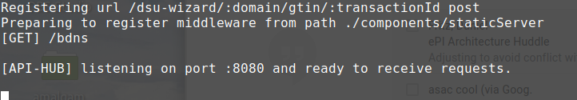

# UC3 Finished Goods Traceability fgt-workspace

*fgt-workspace*  bundles all the necessary dependencies for building and running Finished Goods Traceability SSApps in a single package.

( This workspace was originally forked from the https://github.com/PharmaLedger-IMI/epi-workspace )

## Installation

In order to use the workspace, we need to follow a list of steps presented below. 

### Step 0: Node v12

You need NodeJS version 12.

### Step 1: Clone the workspace

```sh
$ git clone https://github.com/PharmaLedger-IMI/fgt-workspace.git
```

After the repository was cloned, you must install all the dependencies.

```sh
$ cd fgt-workspace
#Important: If you plan to contribute to the project and/or dependecies please set DEV:true
#in the file env.json before you run the installation!
$ npm install
```
**Note:** this command might take quite some time depending on your internet connection and you machine processing power.

### Step 2: Launch the "server"

While in the *fgt-workspace* folder run:

```sh
$ npm run server
```

At the end of this command you get something similar to:




### Step 3: Build all things needed for the application to run.

Open a new console inside *fgt-workspace* folder and run:

```sh
# Note: Run this in a new console inside "fgt-workspace" folder
$ npm run build-all
```


## Running 
To run the application launch your browser (preferably Chrome) in Incognito mode and access the http://localhost:8080 link.

### MAH Enterprise wallet

TODO

### Wholesaler Enterprise wallet

TODO

### Pharmacy Enterprise wallet

TODO

### Build Android APK

TODO Not working...

Steps

1. Install all dependencies (as develoment) for this workspace
```sh
npm run dev-install
```

2. Bind Android repository into workspace
```sh
npm run install-mobile
```

3. Launch API HUB
```sh
npm run server
```

4. Prepare the Node files that will be packed into the Android app
```sh
#In another tab / console
npm build-mobile
```

5. Have /mobile/scan-app/android/local.properties file with the following content

```sh
# Change the value to your SDK path
sdk.dir=/home/alex/Android/Sdk
```
More on this [here](https://github.com/PrivateSky/android-edge-agent#iv-setup-local-environment-values)

6. Build the APK
```sh
npm build-android-apk
```

This concludes the steps to build the APK file.

**Note:** The .apk file should be in folder
```
mobile/scan-app/android/app/build/outputs/apk/release
```

## Workspace Description
### pre-install (before running npm install)

* apihub-root: Folder containing the root of what is served by the server
    * external-volume: configs directory;
    * internal-volume: volume folder (brick storage). contains the several configured domains
    * wallet patch folders: the folders contain, in the wallet-patch folder and for each case, the custom 'behaviour' that is added to the template folder:
        * fgt-mah-wallet/wallet-patch;
        * fgt-pharmacy-wallet/wallet-patch;
        * fgt-wholesaler-wallet/wallet-patch;
* fgt-dsu-wizard: based on gtin-dsu-wizard
* fgt-mah-wallet
* fgt-pharmacy-wallet
* fgt-wholesaler-wallet
    * Wallets for each one of the actors
* trust-loader-config: custom config to override the wallet loader default ones for each case:
    * fgt-mah-fabric-wallet/loader;
    * fgt-pharmacy-fabric-wallet/loader;
    * fgt-wholesaler-fabric-wallet/loader;

### post install (after running npm install)

* General use:
    * cardinal: the web framework used for frontend;    
    * pharmaledger-wallet: the default wallet implementation to be used by all ssapps - comes from http://github.com/privatesky/menu-wallet-prototype.git
    * node_modules: node modules folder (includes the octopus custom builder)
    * privatesky: the openDSU code. notable folders are:
        * privatesky/modules: all the code for the several modules (openDSU is one of them);
        * privatesky/psknode/bundles: all the code from the previous path, with each module bundled into a single file;
    * themes: the folder with all the installed themes:
        * pharmaledger-theme: custom theme for the pharmaledger implementation comes from https://github.com/PrivateSky/blue-fluorite-theme;
* Use case related:
    * Apihub-root: Folder changes:
        * wallet loaders: clones the loader into each of the wallets:
            * fgt-mah-wallet/loader;
            * fgt-pharmacy-wallet/loader;
            * fgt-wholesaler wallet/loader;
    * fgt-mah-ssapp: The application for the Mah;
    * fgt-pharmacy-ssapp: The application for the pharmacy;
    * fgt-wholesaler-ssapp: The application for the wholesaler;
    * gtin-dsu-wizard: the ssapp the creates GTIN based DSUs. *Cloned from epi*;
    * gtin-resolver: the 'library' to resolve gtin+batchs to dsus. *Cloned from epi*;


