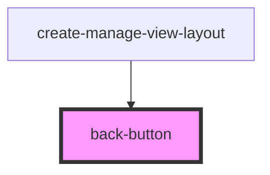

# back-button

<!-- Auto Generated Below -->

## Properties

| Property         | Attribute          | Description | Type      | Default              |
| ---------------- | ------------------ | ----------- | --------- | -------------------- |
| `buttonCssClass` | `button-css-class` |             | `string`  | `'ion-margin-start'` |
| `color`          | `color`            |             | `string`  | `'secondary'`        |
| `disabled`       | `disabled`         |             | `boolean` | `false`              |
| `expand`         | `expand`           |             | `string`  | `'full'`             |
| `fill`           | `fill`             |             | `string`  | `'clear'`            |
| `hidden`         | `hidden`           |             | `boolean` | `false`              |
| `iconCssClass`   | `icon-css-class`   |             | `string`  | `'ion-margin-end'`   |
| `label`          | `label`            |             | `string`  | `'Go back'`          |
| `shape`          | `shape`            |             | `string`  | `'default'`          |
| `size`           | `size`             |             | `string`  | `'default'`          |
| `strong`         | `strong`           |             | `boolean` | `false`              |

## Events

| Event                 | Description | Type               |
| --------------------- | ----------- | ------------------ |
| `ssapp-back-navigate` |             | `CustomEvent<any>` |

## Dependencies

### Used by

 - [create-manage-view-layout](../create-manage-view-layout)

### Graph

----------------------------------------------

*Built with [StencilJS](https://stenciljs.com/)*
