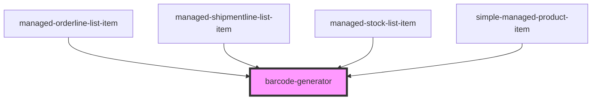

# barcode-generator

<!-- Auto Generated Below -->

## Properties

| Property       | Attribute       | Description                                                                                                                                                       | Type      | Default     |
| -------------- | --------------- | ----------------------------------------------------------------------------------------------------------------------------------------------------------------- | --------- | ----------- |
| `barcodeTitle` | `barcode-title` | description: `A barcodeTitle that will be used for the current component instance.`, isMandatory: false, propertyType: `string`                                   | `string`  | `""`        |
| `data`         | `data`          |                                                                                                                                                                   | `any`     | `undefined` |
| `includeText`  | `include-text`  |                                                                                                                                                                   | `boolean` | `false`     |
| `scale`        | `scale`         |                                                                                                                                                                   | `any`     | `3`         |
| `size`         | `size`          | description: `The size of the barcode in mm. Default is set to 32 mm.`, isMandatory: false, propertyType: `integer`                                               | `any`     | `32`        |
| `type`         | `type`          | description: `The barcode type. Accepted values are 'gs1datamatrix','datamatrix','qrcode', 'code128','code11','isbn'.`, isMandatory: true, propertyType: `string` | `string`  | `"qrcode"`  |

## Dependencies

### Used by

 - [managed-orderline-list-item](../managed-orderline-list-item)
 - [managed-shipmentline-list-item](../managed-shipmentline-list-item)
 - [managed-stock-list-item](../managed-stock-list-item)
 - [simple-managed-product-item](../simple-managed-product-item)

### Graph

----------------------------------------------

*Built with [StencilJS](https://stenciljs.com/)*
