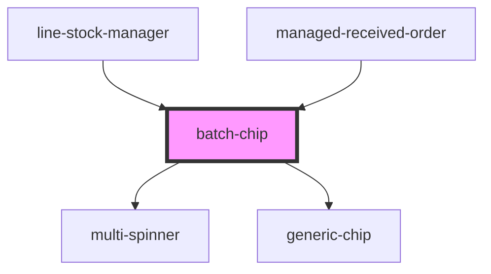

# batch-chip

<!-- Auto Generated Below -->

## Properties

| Property          | Attribute          | Description | Type     | Default                     |
| ----------------- | ------------------ | ----------- | -------- | --------------------------- |
| `expiryThreshold` | `expiry-threshold` |             | `number` | `30`                        |
| `gtinBatch`       | `gtin-batch`       |             | `string` | `undefined`                 |
| `loaderType`      | `loader-type`      |             | `string` | `SUPPORTED_LOADERS.circles` |
| `mode`            | `mode`             |             | `string` | `CHIP_TYPE.SIMPLE`          |
| `quantity`        | `quantity`         |             | `number` | `undefined`                 |

## Events

| Event         | Description | Type                  |
| ------------- | ----------- | --------------------- |
| `selectEvent` |             | `CustomEvent<string>` |

## Dependencies

### Used by

 - [line-stock-manager](../line-stock-manager)
 - [managed-received-order](../managed-received-order)

### Depends on

- [multi-spinner](../multi-spinner)
- [generic-chip](../generic-chip)

### Graph

----------------------------------------------

*Built with [StencilJS](https://stenciljs.com/)*
