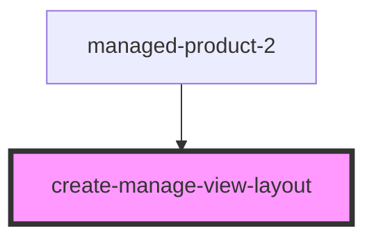

# create-manage-view-layout

<!-- Auto Generated Below -->

## Properties

| Property            | Attribute             | Description | Type      | Default           |
| ------------------- | --------------------- | ----------- | --------- | ----------------- |
| `backString`        | `back-string`         |             | `string`  | `"Back"`          |
| `clearString`       | `clear-string`        |             | `string`  | `"Clear"`         |
| `createString`      | `create-string`       |             | `string`  | `"Create"`        |
| `createTitleString` | `create-title-string` |             | `string`  | `"Create String"` |
| `iconName`          | `icon-name`           |             | `string`  | `"grid"`          |
| `isCreate`          | `is-create`           |             | `boolean` | `true`            |
| `manageTitleString` | `manage-title-string` |             | `string`  | `"Manage String"` |

## Events

| Event         | Description | Type               |
| ------------- | ----------- | ------------------ |
| `createEvent` |             | `CustomEvent<{}>`  |
| `goBackEvent` |             | `CustomEvent<any>` |

## Methods

### `clear() => Promise<void>`

#### Returns

Type: `Promise<void>`

### `getInput(name: string) => Promise<any>`

#### Returns

Type: `Promise<any>`

## Dependencies

### Used by

 - [managed-product-2](../managed-product-2)

### Graph

----------------------------------------------

*Built with [StencilJS](https://stenciljs.com/)*
