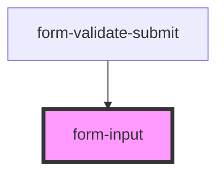

# form-input

<!-- Auto Generated Below -->

## Properties

| Property        | Attribute        | Description | Type                                 | Default              |
| --------------- | ---------------- | ----------- | ------------------------------------ | -------------------- |
| `cssClass`      | `class`          |             | `string \| string[]`                 | `''`                 |
| `input`         | `input`          |             | `any`                                | `undefined`          |
| `inputPrefix`   | `input-prefix`   |             | `string`                             | `INPUT_FIELD_PREFIX` |
| `labelPosition` | `label-position` |             | `"fixed" \| "floating" \| "stacked"` | `'floating'`         |
| `lines`         | `lines`          |             | `"full" \| "inset" \| "none"`        | `'inset'`            |

## Events

| Event              | Description                                 | Type               |
| ------------------ | ------------------------------------------- | ------------------ |
| `ssapp-action`     | Through this event action requests are made | `CustomEvent<any>` |
| `ssapp-send-error` | Through this event errors are passed        | `CustomEvent<any>` |

## Dependencies

### Used by

 - [form-validate-submit](../form-validate-submit)

### Graph

----------------------------------------------

*Built with [StencilJS](https://stenciljs.com/)*
