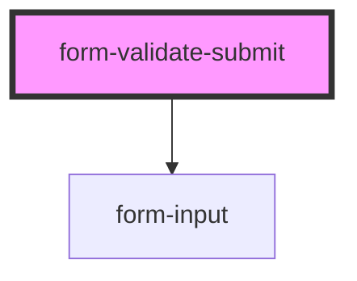

# form-validate-submit

<!-- Auto Generated Below -->

## Properties

| Property           | Attribute                  | Description | Type                                 | Default                     |
| ------------------ | -------------------------- | ----------- | ------------------------------------ | --------------------------- |
| `customValidation` | `enable-custom-validation` |             | `boolean`                            | `false`                     |
| `formJSON`         | `form-json`                |             | `string`                             | `'{}'`                      |
| `labelPosition`    | `label-position`           |             | `"fixed" \| "floating" \| "stacked"` | `'floating'`                |
| `lines`            | `lines`                    |             | `"full" \| "inset" \| "none"`        | `'inset'`                   |
| `loaderType`       | `loader-type`              |             | `string`                             | `SUPPORTED_LOADERS.circles` |

## Events

| Event                | Description                                             | Type               |
| -------------------- | ------------------------------------------------------- | ------------------ |
| `ssapp-action`       | Through this event action requests are made             | `CustomEvent<any>` |
| `ssapp-navigate-tab` | Through this event navigation requests to tabs are made | `CustomEvent<any>` |
| `ssapp-send-error`   | Through this event errors are passed                    | `CustomEvent<any>` |

## Dependencies

### Depends on

- [form-input](../form-input)

### Graph

----------------------------------------------

*Built with [StencilJS](https://stenciljs.com/)*
