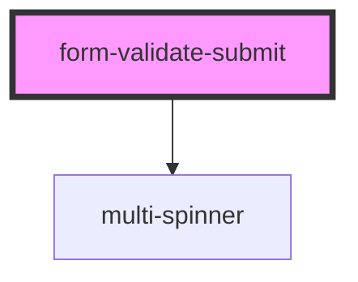

# form-validate-submit

<!-- Auto Generated Below -->

## Properties

| Property     | Attribute     | Description | Type     | Default                     |
| ------------ | ------------- | ----------- | -------- | --------------------------- |
| `formJSON`   | `form-json`   |             | `string` | `'{}'`                      |
| `loaderType` | `loader-type` |             | `string` | `SUPPORTED_LOADERS.circles` |

## Events

| Event                | Description                                             | Type               |
| -------------------- | ------------------------------------------------------- | ------------------ |
| `ssapp-action`       | Through this event action requests are made             | `CustomEvent<any>` |
| `ssapp-navigate-tab` | Through this event navigation requests to tabs are made | `CustomEvent<any>` |
| `ssapp-send-error`   | Through this event errors are passed                    | `CustomEvent<any>` |

## Dependencies

### Depends on

- [multi-spinner](../multi-spinner)

### Graph

----------------------------------------------

*Built with [StencilJS](https://stenciljs.com/)*
