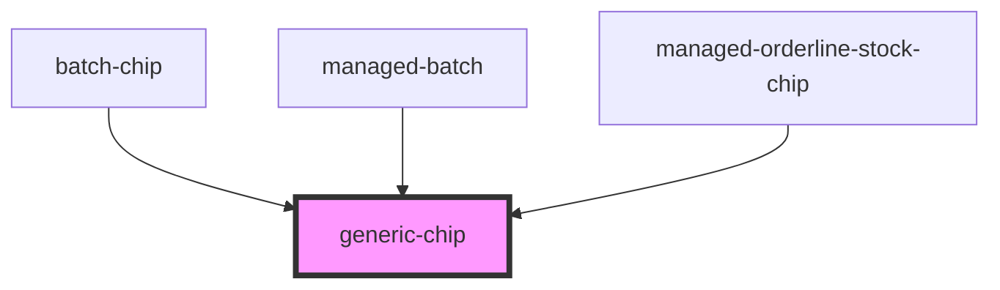

# generic-chip

<!-- Auto Generated Below -->

## Properties

| Property    | Attribute    | Description | Type      | Default       |
| ----------- | ------------ | ----------- | --------- | ------------- |
| `chipLabel` | `chip-label` |             | `string`  | `undefined`   |
| `color`     | `color`      |             | `string`  | `"secondary"` |
| `outline`   | `outline`    |             | `boolean` | `true`        |

## Events

| Event         | Description | Type                  |
| ------------- | ----------- | --------------------- |
| `selectEvent` |             | `CustomEvent<string>` |

## Dependencies

### Used by

 - [batch-chip](../batch-chip)
 - [managed-batch](../managed-batch)
 - [managed-orderline-stock-chip](../managed-orderline-stock-chip)

### Graph

----------------------------------------------

*Built with [StencilJS](https://stenciljs.com/)*
