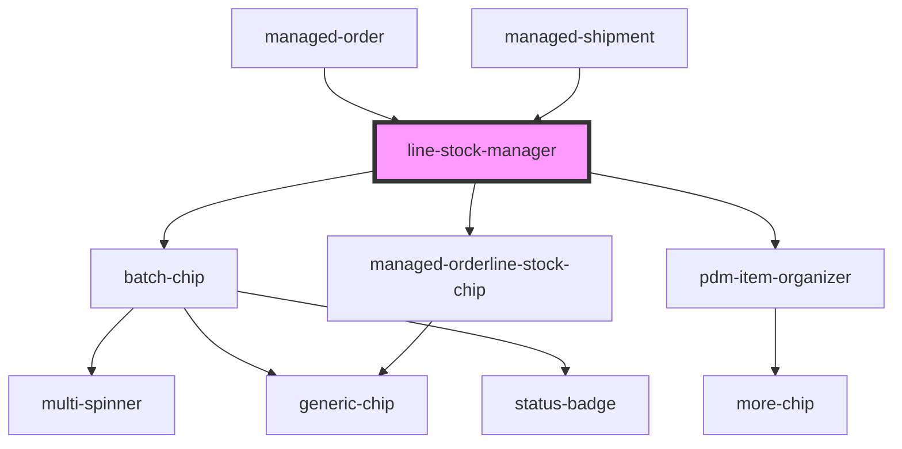

# line-stock-manager

<!-- Auto Generated Below -->

## Properties

| Property             | Attribute              | Description | Type      | Default                      |
| -------------------- | ---------------------- | ----------- | --------- | ---------------------------- |
| `availableString`    | `available-string`     |             | `string`  | `'Available:'`               |
| `confirmAllString`   | `confirm-all-string`   |             | `string`  | `'Confirm All'`              |
| `confirmedString`    | `confirmed-string`     |             | `string`  | `'Confirmed:'`               |
| `enableActions`      | `enable-actions`       |             | `boolean` | `false`                      |
| `lines`              | --                     |             | `any[]`   | `undefined`                  |
| `linesString`        | `lines-string`         |             | `string`  | `'Lines:'`                   |
| `noStockString`      | `no-stock-string`      |             | `string`  | `'Empty'`                    |
| `orderMissingString` | `order-missing-string` |             | `string`  | `'Order Missing'`            |
| `remainingString`    | `remaining-string`     |             | `string`  | `'Remaining:'`               |
| `resetAllString`     | `reset-all-string`     |             | `string`  | `'Reset All'`                |
| `selectString`       | `select-string`        |             | `string`  | `'Please Select an Item...'` |
| `showStock`          | `show-stock`           |             | `boolean` | `false`                      |
| `stockString`        | `stock-string`         |             | `string`  | `'Stock:'`                   |
| `unavailableString`  | `unavailable-string`   |             | `string`  | `'Unavailable:'`             |

## Events

| Event                | Description                                             | Type                  |
| -------------------- | ------------------------------------------------------- | --------------------- |
| `selectEvent`        | Through this select events are sent                     | `CustomEvent<string>` |
| `ssapp-navigate-tab` | Through this event navigation requests to tabs are made | `CustomEvent<any>`    |
| `ssapp-send-error`   | Through this event errors are passed                    | `CustomEvent<any>`    |

## Methods

### `cancelLine(gtin: any) => Promise<void>`

#### Returns

Type: `Promise<void>`

### `getResult() => Promise<any[]>`

#### Returns

Type: `Promise<any[]>`

### `refresh(newVal: any) => Promise<void>`

#### Returns

Type: `Promise<void>`

### `reset() => Promise<void>`

#### Returns

Type: `Promise<void>`

## Dependencies

### Used by

 - [managed-order](../managed-order)
 - [managed-shipment](../managed-shipment)

### Depends on

- [batch-chip](../batch-chip)
- [managed-orderline-stock-chip](../managed-orderline-stock-chip)
- [pdm-item-organizer](../pdm-item-organizer)

### Graph

----------------------------------------------

*Built with [StencilJS](https://stenciljs.com/)*
