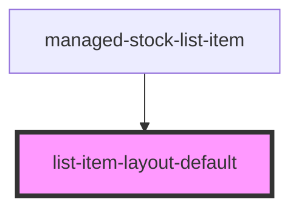

# list-item-layout

<!-- Auto Generated Below -->

## Properties

| Property      | Attribute          | Description | Type      | Default |
| ------------- | ------------------ | ----------- | --------- | ------- |
| `buttons`     | `buttons`          |             | `boolean` | `false` |
| `labelConfig` | `label-col-config` |             | `string`  | `""`    |
| `start`       | `start`            |             | `boolean` | `false` |

## Dependencies

### Used by

 - [managed-stock-list-item](../managed-stock-list-item)

### Graph

----------------------------------------------

*Built with [StencilJS](https://stenciljs.com/)*
