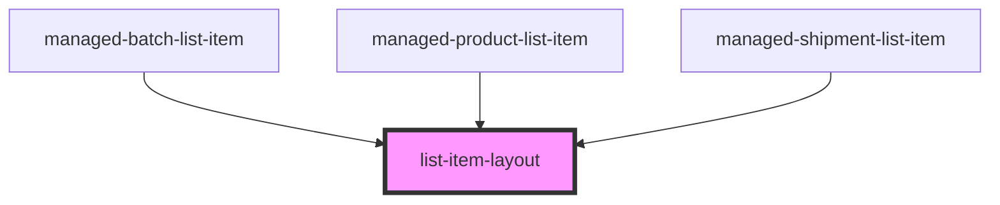

# list-item-layout

<!-- Auto Generated Below -->

## Properties

| Property          | Attribute         | Description | Type                          | Default                     |
| ----------------- | ----------------- | ----------- | ----------------------------- | --------------------------- |
| `adjustmentClass` | `ajustment-class` |             | `string`                      | `"ion-justify-content-end"` |
| `color`           | `color`           |             | `string`                      | `"light"`                   |
| `cssClass`        | `class`           |             | `string`                      | `"ion-margin-bottom"`       |
| `lines`           | `lines`           |             | `"full" \| "inset" \| "none"` | `"none"`                    |

## Dependencies

### Used by

 - [managed-batch-list-item](../managed-batch-list-item)
 - [managed-product-list-item](../managed-product-list-item)
 - [managed-shipment-list-item](../managed-shipment-list-item)

### Graph

----------------------------------------------

*Built with [StencilJS](https://stenciljs.com/)*
