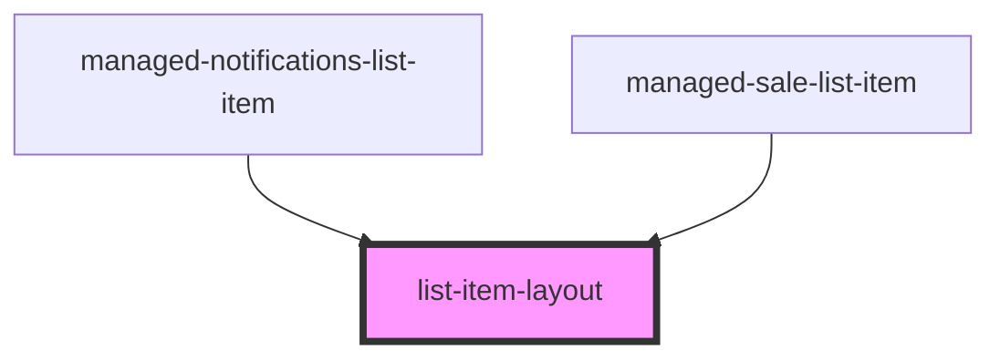

# list-item-layout

<!-- Auto Generated Below -->

## Properties

| Property      | Attribute     | Description | Type                          | Default               |
| ------------- | ------------- | ----------- | ----------------------------- | --------------------- |
| `color`       | `color`       |             | `string`                      | `"light"`             |
| `cssClass`    | `class`       |             | `string`                      | `"ion-margin-bottom"` |
| `labelCol`    | `label-col`   |             | `number`                      | `4`                   |
| `lines`       | `lines`       |             | `"full" \| "inset" \| "none"` | `"none"`              |
| `orientation` | `orientation` |             | `"end" \| "start"`            | `"end"`               |

## Dependencies

### Used by

 - [managed-notifications-list-item](../managed-notifications-list-item)
 - [managed-sale-list-item](../managed-sale-list-item)

### Graph

----------------------------------------------

*Built with [StencilJS](https://stenciljs.com/)*
