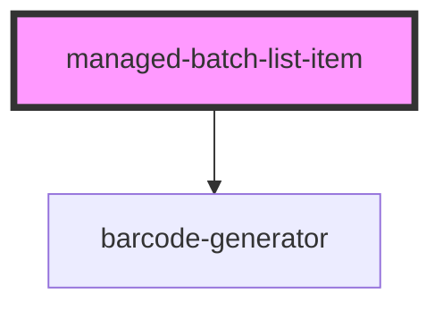

# managed-batch-list-item

<!-- Auto Generated Below -->

## Properties

| Property    | Attribute    | Description | Type     | Default     |
| ----------- | ------------ | ----------- | -------- | ----------- |
| `gtinBatch` | `gtin-batch` |             | `string` | `undefined` |

## Events

| Event              | Description                          | Type               |
| ------------------ | ------------------------------------ | ------------------ |
| `ssapp-send-error` | Through this event errors are passed | `CustomEvent<any>` |

## Methods

### `refresh() => Promise<void>`

#### Returns

Type: `Promise<void>`

## Dependencies

### Depends on

- [barcode-generator](../barcode-generator)

### Graph

----------------------------------------------

*Built with [StencilJS](https://stenciljs.com/)*
