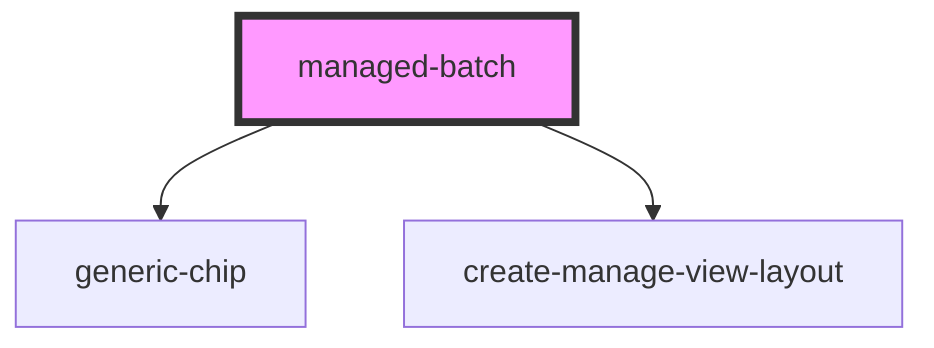

# managed-batch

<!-- Auto Generated Below -->

## Properties

| Property                   | Attribute                    | Description | Type     | Default                                             |
| -------------------------- | ---------------------------- | ----------- | -------- | --------------------------------------------------- |
| `addBatchString`           | `add-batch-string`           |             | `string` | `"Add Batch"`                                       |
| `backString`               | `back-string`                |             | `string` | `"Back to Product"`                                 |
| `batchNumberString`        | `batch-number-string`        |             | `string` | `"Batch Number:"`                                   |
| `clearString`              | `clear-string`               |             | `string` | `"Clear"`                                           |
| `expiryPlaceholderString`  | `expiry-placeholder-string`  |             | `string` | `"Please define an expiry date..."`                 |
| `expiryString`             | `expiry-string`              |             | `string` | `"Expiry:"`                                         |
| `gtinRef`                  | `gtin-ref`                   |             | `string` | `undefined`                                         |
| `manageString`             | `manage-title-string`        |             | `string` | `"Manage Batch"`                                    |
| `serialsPlaceholderString` | `serials-placeholder-string` |             | `string` | `"Please insert comma separated serial numbers..."` |
| `serialsString`            | `serials-string`             |             | `string` | `"Serial Numbers:"`                                 |
| `titleString`              | `create-title-string`        |             | `string` | `"Create Batch for"`                                |

## Events

| Event                | Description                                             | Type               |
| -------------------- | ------------------------------------------------------- | ------------------ |
| `ssapp-action`       | Through this event action requests are made             | `CustomEvent<any>` |
| `ssapp-navigate-tab` | Through this event navigation requests to tabs are made | `CustomEvent<any>` |
| `ssapp-send-error`   | Through this event errors are passed                    | `CustomEvent<any>` |

## Methods

### `refresh() => Promise<void>`

#### Returns

Type: `Promise<void>`

## Dependencies

### Depends on

- [generic-chip](../generic-chip)
- [create-manage-view-layout](../create-manage-view-layout)

### Graph

----------------------------------------------

*Built with [StencilJS](https://stenciljs.com/)*
