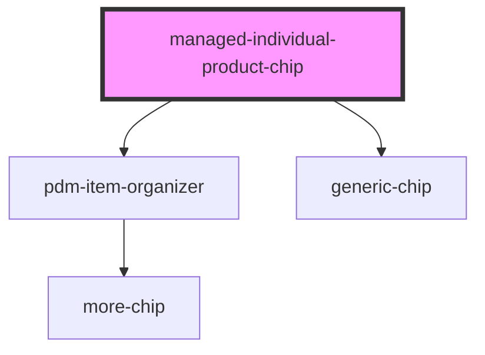

# managed-individual-product-chip

<!-- Auto Generated Below -->

## Properties

| Property          | Attribute          | Description | Type     | Default     |
| ----------------- | ------------------ | ----------- | -------- | ----------- |
| `batchNumber`     | `batch-number`     |             | `string` | `undefined` |
| `expiry`          | `expiry`           |             | `string` | `undefined` |
| `expiryThreshold` | `expiry-threshold` |             | `number` | `30`        |
| `gtin`            | `gtin`             |             | `string` | `undefined` |
| `serials`         | `serials`          |             | `string` | `undefined` |

## Events

| Event         | Description | Type                  |
| ------------- | ----------- | --------------------- |
| `selectEvent` |             | `CustomEvent<string>` |

## Dependencies

### Depends on

- [pdm-item-organizer](../pdm-item-organizer)
- [generic-chip](../generic-chip)

### Graph

----------------------------------------------

*Built with [StencilJS](https://stenciljs.com/)*
