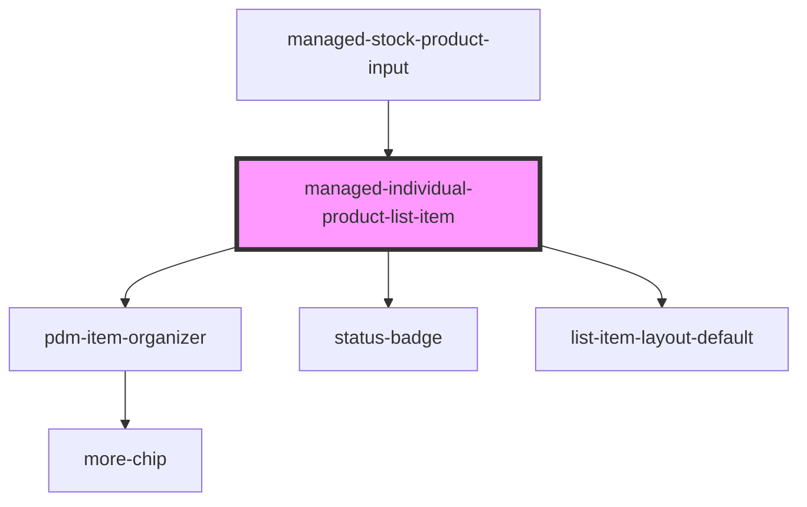

# managed-individual-product-list-item

<!-- Auto Generated Below -->

## Properties

| Property          | Attribute           | Description | Type      | Default     |
| ----------------- | ------------------- | ----------- | --------- | ----------- |
| `gtinBatchSerial` | `gtin-batch-serial` |             | `string`  | `undefined` |
| `isHeader`        | `is-header`         |             | `boolean` | `undefined` |
| `showCloseButton` | `show-close-button` |             | `boolean` | `true`      |
| `showTrackButton` | `show-track-button` |             | `boolean` | `true`      |

## Events

| Event               | Description                                   | Type               |
| ------------------- | --------------------------------------------- | ------------------ |
| `fgt-track-request` | Through this event tracking requests are made | `CustomEvent<any>` |
| `ssapp-action`      | Through this event action requests are made   | `CustomEvent<any>` |
| `ssapp-send-error`  | Through this event errors are passed          | `CustomEvent<any>` |

## Methods

### `refresh(newValue?: any) => Promise<void>`

#### Returns

Type: `Promise<void>`

## Dependencies

### Used by

 - [managed-stock-product-input](../managed-stock-product-input)

### Depends on

- [pdm-item-organizer](../pdm-item-organizer)
- [status-badge](../status-badge)
- [list-item-layout-default](../list-item-layout-default)

### Graph

----------------------------------------------

*Built with [StencilJS](https://stenciljs.com/)*
