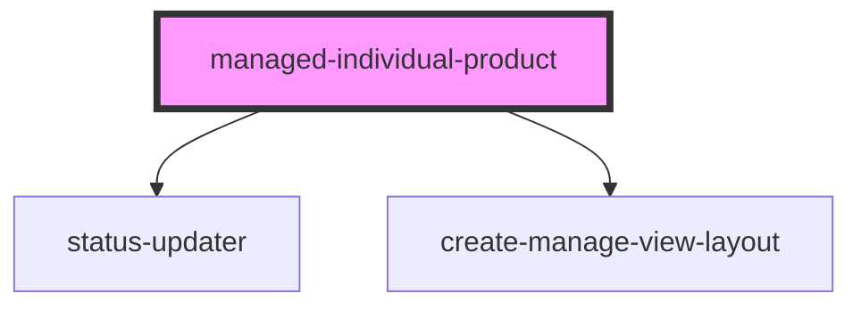

# managed-individual-product

<!-- Auto Generated Below -->

## Properties

| Property        | Attribute             | Description | Type     | Default                     |
| --------------- | --------------------- | ----------- | -------- | --------------------------- |
| `backString`    | `back-string`         |             | `string` | `"Back to Products"`        |
| `batchString`   | `batch-string`        |             | `string` | `"Batch"`                   |
| `expiryString`  | `expiry-string`       |             | `string` | `"Product Expiry"`          |
| `gtinString`    | `gtin-string`         |             | `string` | `"Product Gtin"`            |
| `individualRef` | `individual-ref`      |             | `string` | `undefined`                 |
| `manageString`  | `title-string`        |             | `string` | `"Manage String"`           |
| `manufString`   | `manuf-string`        |             | `string` | `"Product Manufacturer Id"` |
| `nameString`    | `product-name-string` |             | `string` | `"Product Name"`            |
| `serialString`  | `serial-string`       |             | `string` | `"SerialNumber"`            |
| `statusString`  | `status-string`       |             | `string` | `"Status"`                  |
| `statuses`      | `statuses`            |             | `any`    | `undefined`                 |

## Events

| Event                 | Description                                             | Type               |
| --------------------- | ------------------------------------------------------- | ------------------ |
| `ssapp-action`        | Through this event action requests are made             | `CustomEvent<any>` |
| `ssapp-back-navigate` | Through this event navigation requests to tabs are made | `CustomEvent<any>` |
| `ssapp-send-error`    | Through this event errors are passed                    | `CustomEvent<any>` |

## Methods

### `refresh() => Promise<void>`

#### Returns

Type: `Promise<void>`

### `reset() => Promise<void>`

#### Returns

Type: `Promise<void>`

## Dependencies

### Depends on

- [status-updater](../status-updater)
- [create-manage-view-layout](../create-manage-view-layout)

### Graph

----------------------------------------------

*Built with [StencilJS](https://stenciljs.com/)*
