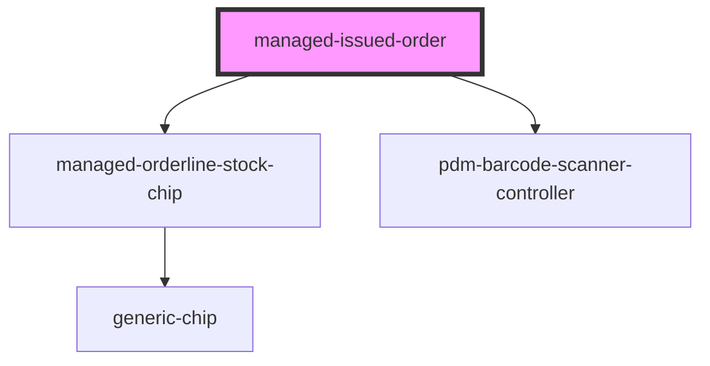

# managed-issued-order

<!-- Auto Generated Below -->

## Properties

| Property                | Attribute                 | Description | Type     | Default                  |
| ----------------------- | ------------------------- | ----------- | -------- | ------------------------ |
| `detailsString`         | `details-string`          |             | `string` | `'Details:'`             |
| `directoryString`       | `directory-string`        |             | `string` | `'Directory:'`           |
| `fromAtString`          | `from-at-string`          |             | `string` | `'At:'`                  |
| `fromPlaceholderString` | `from-placeholder-string` |             | `string` | `'Select a supplier...'` |
| `fromString`            | `from-string`             |             | `string` | `'Order from:'`          |
| `orderLines`            | `order-lines`             |             | `any`    | `undefined`              |
| `orderLinesString`      | `order-lines-string`      |             | `string` | `'OrderLines:'`          |
| `proceedString`         | `proceed-string`          |             | `string` | `'Issue Order'`          |
| `productsCodeString`    | `products-code-string`    |             | `string` | `'Product Code:'`        |
| `productsString`        | `products-string`         |             | `string` | `'Products:'`            |
| `quantityString`        | `quantity-string`         |             | `string` | `'Quantity:'`            |
| `requester`             | `requester`               |             | `any`    | `undefined`              |
| `titleString`           | `title-string`            |             | `string` | `'Create Order'`         |
| `toAtString`            | `to-at-string`            |             | `string` | `'from:'`                |

## Events

| Event              | Description                                             | Type               |
| ------------------ | ------------------------------------------------------- | ------------------ |
| `created`          | Through this event order creation requests are made     | `CustomEvent<any>` |
| `ssapp-action`     | Through this event navigation requests to tabs are made | `CustomEvent<any>` |
| `ssapp-send-error` | Through this event errors are passed                    | `CustomEvent<any>` |

## Methods

### `updateDirectory() => Promise<void>`

#### Returns

Type: `Promise<void>`

## Dependencies

### Depends on

- [managed-orderline-stock-chip](../managed-orderline-stock-chip)
- [pdm-barcode-scanner-controller](../pdm-barcode-scanner-controller)

### Graph

----------------------------------------------

*Built with [StencilJS](https://stenciljs.com/)*
