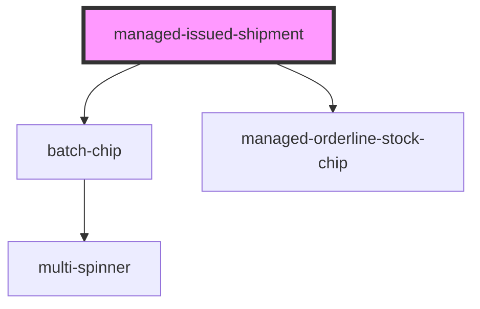

# managed-issued-shipment

<!-- Auto Generated Below -->

## Properties

| Property              | Attribute            | Description | Type     | Default                        |
| --------------------- | -------------------- | ----------- | -------- | ------------------------------ |
| `availableString`     | `available-string`   |             | `string` | `'Available:'`                 |
| `confirmedString`     | `confirmed-string`   |             | `string` | `'Confirmed:'`                 |
| `delayString`         | `delay-string`       |             | `string` | `'Delay:'`                     |
| `detailsString`       | `details-string`     |             | `string` | `'Details:'`                   |
| `noStockString`       | `no-stock-string`    |             | `string` | `'Empty'`                      |
| `proceedString`       | `proceed-string`     |             | `string` | `'Continue:'`                  |
| `productsString`      | `products-string`    |             | `string` | `'Products:'`                  |
| `rejectString`        | `reject-string`      |             | `string` | `'Reject'`                     |
| `remainingString`     | `remaining-string`   |             | `string` | `'Remaining:'`                 |
| `selectProductString` | `select-product`     |             | `string` | `'Please Select a Product...'` |
| `shipmentId`          | `shipment-id`        |             | `string` | `undefined`                    |
| `stockString`         | `stock-string`       |             | `string` | `'Stock:'`                     |
| `titleString`         | `title-string`       |             | `string` | `'Process Shipment'`           |
| `unavailableString`   | `unavailable-string` |             | `string` | `'Unavailable:'`               |

## Events

| Event             | Description                                             | Type               |
| ----------------- | ------------------------------------------------------- | ------------------ |
| `created`         | Through this event shipment creation requests are made  | `CustomEvent<any>` |
| `rejected`        | Through this event shipment rejection requests are made | `CustomEvent<any>` |
| `sendErrorEvent`  | Through this event errors are passed                    | `CustomEvent<any>` |
| `sendNavigateTab` | Through this event navigation requests to tabs are made | `CustomEvent<any>` |

## Methods

### `refresh() => Promise<void>`

#### Returns

Type: `Promise<void>`

### `selectOrderLine(gtin: any) => Promise<void>`

#### Returns

Type: `Promise<void>`

## Dependencies

### Depends on

- [batch-chip](../batch-chip)
- [managed-orderline-stock-chip](../managed-orderline-stock-chip)

### Graph

----------------------------------------------

*Built with [StencilJS](https://stenciljs.com/)*
