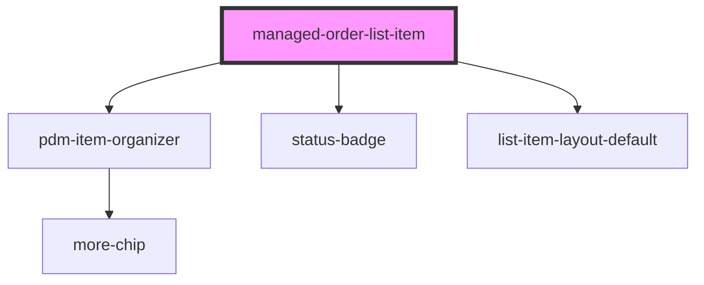

# managed-product-list-item

<!-- Auto Generated Below -->

## Properties

| Property   | Attribute   | Description | Type      | Default             |
| ---------- | ----------- | ----------- | --------- | ------------------- |
| `isHeader` | `is-header` |             | `boolean` | `undefined`         |
| `orderId`  | `order-id`  |             | `string`  | `undefined`         |
| `type`     | `type`      |             | `string`  | `ORDER_TYPE.ISSUED` |

## Events

| Event                | Description                                             | Type               |
| -------------------- | ------------------------------------------------------- | ------------------ |
| `ssapp-navigate-tab` | Through this event navigation requests to tabs are made | `CustomEvent<any>` |
| `ssapp-send-error`   | Through this event errors are passed                    | `CustomEvent<any>` |

## Methods

### `refresh(newOrder?: any, oldOrder?: any) => Promise<void>`

#### Returns

Type: `Promise<void>`

## Dependencies

### Depends on

- [pdm-item-organizer](../pdm-item-organizer)
- [status-badge](../status-badge)
- [list-item-layout-default](../list-item-layout-default)

### Graph

----------------------------------------------

*Built with [StencilJS](https://stenciljs.com/)*
