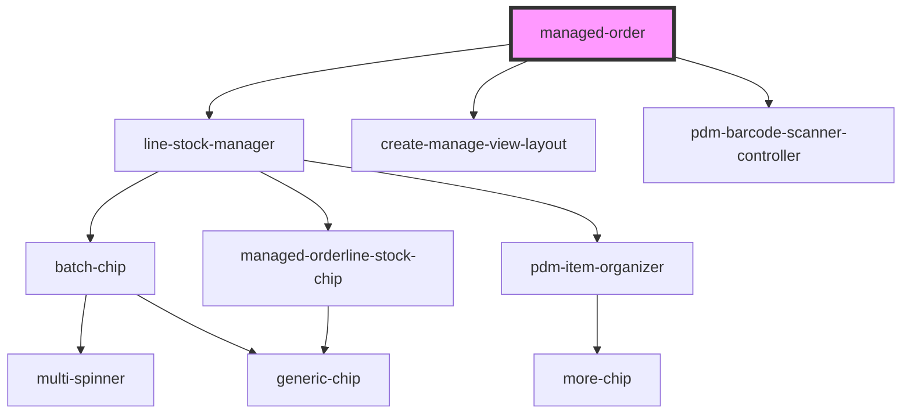

# managed-order

<!-- Auto Generated Below -->

## Properties

| Property                | Attribute                 | Description | Type     | Default                      |
| ----------------------- | ------------------------- | ----------- | -------- | ---------------------------- |
| `availableString`       | `available-string`        |             | `string` | `'Available:'`               |
| `backString`            | `back-string`             |             | `string` | `"Back to Products"`         |
| `clearString`           | `clear-string`            |             | `string` | `"Clear"`                    |
| `confirmAllString`      | `confirm-all-string`      |             | `string` | `'Confirm All'`              |
| `confirmedString`       | `confirmed-string`        |             | `string` | `'Confirmed:'`               |
| `createString`          | `create-string`           |             | `string` | `"Issue Order"`              |
| `delayString`           | `delay-string`            |             | `string` | `'Delay:'`                   |
| `detailsString`         | `details-string`          |             | `string` | `'Details:'`                 |
| `directoryString`       | `directory-string`        |             | `string` | `'Directory:'`               |
| `fromAtString`          | `from-at-string`          |             | `string` | `'At:'`                      |
| `fromPlaceholderString` | `from-placeholder-string` |             | `string` | `'Select a supplier...'`     |
| `fromString`            | `from-string`             |             | `string` | `'Order from:'`              |
| `identity`              | `identity`                |             | `any`    | `undefined`                  |
| `manageString`          | `manage-title-string`     |             | `string` | `"Manage String"`            |
| `noStockString`         | `no-stock-string`         |             | `string` | `'Empty'`                    |
| `orderLines`            | `order-lines-json`        |             | `string` | `undefined`                  |
| `orderLinesString`      | `order-lines-string`      |             | `string` | `'OrderLines:'`              |
| `orderMissingString`    | `order-missing-string`    |             | `string` | `'Order Missing'`            |
| `orderRef`              | `order-ref`               |             | `string` | `undefined`                  |
| `orderType`             | `order-type`              |             | `string` | `ORDER_TYPE.ISSUED`          |
| `proceedString`         | `proceed-string`          |             | `string` | `'Continue:'`                |
| `productsCodeString`    | `products-code-string`    |             | `string` | `'Product Code:'`            |
| `productsString`        | `products-string`         |             | `string` | `'Products:'`                |
| `quantityString`        | `quantity-string`         |             | `string` | `'Quantity:'`                |
| `rejectString`          | `reject-string`           |             | `string` | `'Reject'`                   |
| `remainingString`       | `remaining-string`        |             | `string` | `'Remaining:'`               |
| `resetAllString`        | `reset-all-string`        |             | `string` | `'Reset All'`                |
| `scanString`            | `scanner-title-string`    |             | `string` | `"Please Scan your Product"` |
| `selectString`          | `select-string`           |             | `string` | `'Please Select an item...'` |
| `statusString`          | `status-string`           |             | `string` | `'Shipment Status:'`         |
| `stockString`           | `stock-string`            |             | `string` | `'Stock:'`                   |
| `titleString`           | `create-title-string`     |             | `string` | `"Title String"`             |
| `toAtString`            | `to-at-string`            |             | `string` | `'from:'`                    |
| `unavailableString`     | `unavailable-string`      |             | `string` | `'Unavailable:'`             |

## Events

| Event                | Description                                             | Type               |
| -------------------- | ------------------------------------------------------- | ------------------ |
| `ssapp-action`       | Through this event action requests are made             | `CustomEvent<any>` |
| `ssapp-navigate-tab` | Through this event navigation requests to tabs are made | `CustomEvent<any>` |
| `ssapp-send-error`   | Through this event errors are passed                    | `CustomEvent<any>` |

## Methods

### `refresh() => Promise<void>`

#### Returns

Type: `Promise<void>`

### `reset() => Promise<void>`

#### Returns

Type: `Promise<void>`

### `updateDirectory() => Promise<void>`

#### Returns

Type: `Promise<void>`

## Dependencies

### Depends on

- [line-stock-manager](../line-stock-manager)
- [create-manage-view-layout](../create-manage-view-layout)
- [pdm-barcode-scanner-controller](../pdm-barcode-scanner-controller)

### Graph

----------------------------------------------

*Built with [StencilJS](https://stenciljs.com/)*
