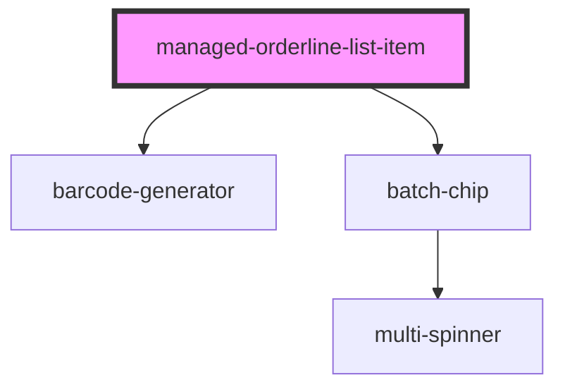

# managed-orderline-list-item

<!-- Auto Generated Below -->

## Properties

| Property    | Attribute    | Description | Type     | Default     |
| ----------- | ------------ | ----------- | -------- | ----------- |
| `orderLine` | `order-line` |             | `string` | `undefined` |

## Events

| Event                | Description                                             | Type               |
| -------------------- | ------------------------------------------------------- | ------------------ |
| `sendErrorEvent`     | Through this event errors are passed                    | `CustomEvent<any>` |
| `ssapp-navigate-tab` | Through this event navigation requests to tabs are made | `CustomEvent<any>` |

## Methods

### `refresh() => Promise<void>`

#### Returns

Type: `Promise<void>`

## Dependencies

### Depends on

- [barcode-generator](../barcode-generator)
- [batch-chip](../batch-chip)

### Graph

----------------------------------------------

*Built with [StencilJS](https://stenciljs.com/)*
