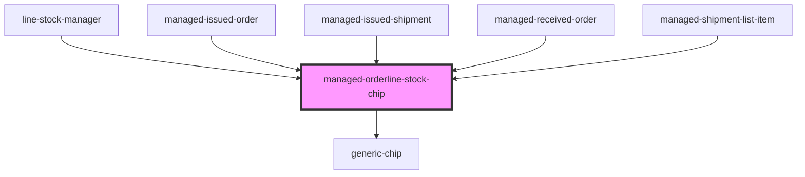

# managed-orderline-stock-chip

<!-- Auto Generated Below -->

## Properties

| Property     | Attribute     | Description | Type     | Default                           |
| ------------ | ------------- | ----------- | -------- | --------------------------------- |
| `available`  | `available`   |             | `number` | `undefined`                       |
| `button`     | `button`      |             | `string` | `undefined`                       |
| `gtin`       | `gtin`        |             | `string` | `undefined`                       |
| `loaderType` | `loader-type` |             | `string` | `SUPPORTED_LOADERS.bubblingSmall` |
| `mode`       | `mode`        |             | `string` | `CHIP_TYPE.SIMPLE`                |
| `quantity`   | `quantity`    |             | `number` | `undefined`                       |
| `threshold`  | `threshold`   |             | `number` | `30`                              |

## Events

| Event        | Description                           | Type                                   |
| ------------ | ------------------------------------- | -------------------------------------- |
| `sendAction` | Through this event actions are passed | `CustomEvent<OverlayEventDetail<any>>` |

## Dependencies

### Used by

 - [line-stock-manager](../line-stock-manager)
 - [managed-issued-order](../managed-issued-order)
 - [managed-issued-shipment](../managed-issued-shipment)
 - [managed-received-order](../managed-received-order)
 - [managed-shipment-list-item](../managed-shipment-list-item)

### Depends on

- [generic-chip](../generic-chip)

### Graph

----------------------------------------------

*Built with [StencilJS](https://stenciljs.com/)*
