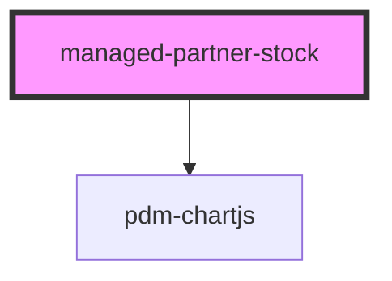

# managed-shipment

<!-- Auto Generated Below -->

## Properties

| Property            | Attribute             | Description | Type     | Default      |
| ------------------- | --------------------- | ----------- | -------- | ------------ |
| `batchInputLabel`   | `batch-input-label`   |             | `string` | `'Batch:'`   |
| `partnerInputLabel` | `partner-input-label` |             | `string` | `'Partner:'` |
| `productInputLabel` | `gtin-input-label`    |             | `string` | `'Product:'` |

## Events

| Event              | Description                          | Type               |
| ------------------ | ------------------------------------ | ------------------ |
| `ssapp-send-error` | Through this event errors are passed | `CustomEvent<any>` |

## Dependencies

### Depends on

- [pdm-chartjs](../pdm-chartjs)

### Graph

----------------------------------------------

*Built with [StencilJS](https://stenciljs.com/)*
