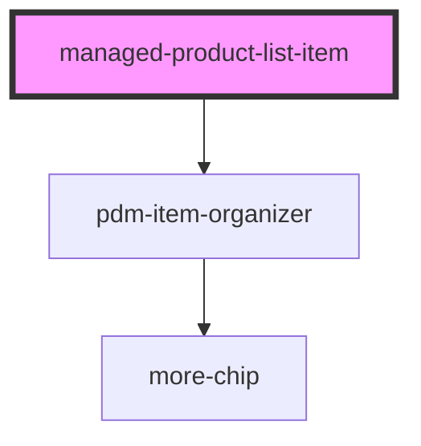

# managed-product-list-item

<!-- Auto Generated Below -->

## Properties

| Property            | Attribute             | Description | Type     | Default     |
| ------------------- | --------------------- | ----------- | -------- | ----------- |
| `batchDisplayCount` | `batch-display-count` |             | `number` | `3`         |
| `gtin`              | `gtin`                |             | `string` | `undefined` |

## Events

| Event                | Description                                             | Type               |
| -------------------- | ------------------------------------------------------- | ------------------ |
| `ssapp-navigate-tab` | Through this event navigation requests to tabs are made | `CustomEvent<any>` |
| `ssapp-send-error`   | Through this event errors are passed                    | `CustomEvent<any>` |

## Methods

### `refresh() => Promise<void>`

#### Returns

Type: `Promise<void>`

## Dependencies

### Depends on

- [pdm-item-organizer](../pdm-item-organizer)

### Graph

----------------------------------------------

*Built with [StencilJS](https://stenciljs.com/)*
