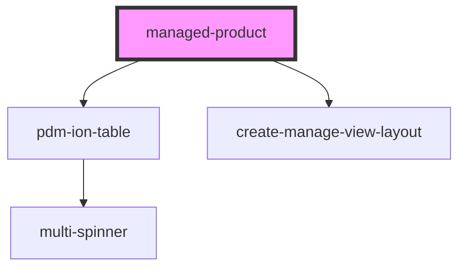

# managed-product

<!-- Auto Generated Below -->

## Properties

| Property                       | Attribute                        | Description | Type     | Default                           |
| ------------------------------ | -------------------------------- | ----------- | -------- | --------------------------------- |
| `addProductString`             | `add-product-string`             |             | `string` | `"Add Product"`                   |
| `backString`                   | `back-string`                    |             | `string` | `"Back to Products"`              |
| `batchesAddButton`             | `batches-add-button-string`      |             | `string` | `"Add Batch"`                     |
| `batchesTitle`                 | `batches-title-string`           |             | `string` | `"Batches for"`                   |
| `clearString`                  | `clear-string`                   |             | `string` | `"Clear"`                         |
| `descriptionPlaceholderString` | `description-placeholder-string` |             | `string` | `"Enter any description here..."` |
| `descriptionString`            | `description-string`             |             | `string` | `"Product Description"`           |
| `gtin`                         | `gtin`                           |             | `string` | `undefined`                       |
| `gtinString`                   | `gtin-string`                    |             | `string` | `"Product Gtin"`                  |
| `manageString`                 | `manage-title-string`            |             | `string` | `"Manage String"`                 |
| `manufName`                    | `manuf-name`                     |             | `string` | `undefined`                       |
| `manufString`                  | `manuf-string`                   |             | `string` | `"Product Manufacturer Id"`       |
| `nameString`                   | `product-name-string`            |             | `string` | `"Product Name"`                  |
| `titleString`                  | `create-title-string`            |             | `string` | `"Title String"`                  |

## Events

| Event                 | Description                                             | Type               |
| --------------------- | ------------------------------------------------------- | ------------------ |
| `ssapp-action`        | Through this event action requests are made             | `CustomEvent<any>` |
| `ssapp-back-navigate` | Through this event navigation requests to tabs are made | `CustomEvent<any>` |
| `ssapp-send-error`    | Through this event errors are passed                    | `CustomEvent<any>` |

## Methods

### `refresh() => Promise<void>`

#### Returns

Type: `Promise<void>`

### `reset() => Promise<void>`

#### Returns

Type: `Promise<void>`

## Dependencies

### Depends on

- [pdm-ion-table](../pdm-ion-table)
- [create-manage-view-layout](../create-manage-view-layout)

### Graph

----------------------------------------------

*Built with [StencilJS](https://stenciljs.com/)*
