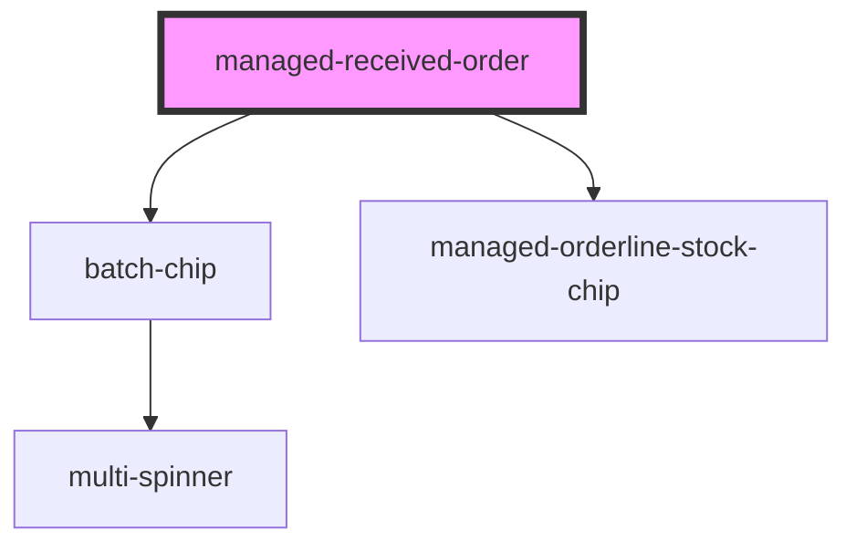

# managed-received-order

<!-- Auto Generated Below -->

## Properties

| Property            | Attribute            | Description | Type     | Default           |
| ------------------- | -------------------- | ----------- | -------- | ----------------- |
| `availableString`   | `available-string`   |             | `string` | `'Available:'`    |
| `detailsString`     | `details-string`     |             | `string` | `'Details:'`      |
| `noStockString`     | `no-stock-string`    |             | `string` | `'Empty'`         |
| `orderId`           | `order-id`           |             | `string` | `undefined`       |
| `productsString`    | `products-string`    |             | `string` | `'Products:'`     |
| `stockString`       | `stock-string`       |             | `string` | `'Stock:'`        |
| `titleString`       | `title-string`       |             | `string` | `'Process Order'` |
| `unavailableString` | `unavailable-string` |             | `string` | `'Unavailable:'`  |

## Events

| Event             | Description                                             | Type               |
| ----------------- | ------------------------------------------------------- | ------------------ |
| `sendErrorEvent`  | Through this event errors are passed                    | `CustomEvent<any>` |
| `sendNavigateTab` | Through this event navigation requests to tabs are made | `CustomEvent<any>` |

## Methods

### `refresh() => Promise<void>`

#### Returns

Type: `Promise<void>`

## Dependencies

### Depends on

- [batch-chip](../batch-chip)
- [managed-orderline-stock-chip](../managed-orderline-stock-chip)

### Graph

----------------------------------------------

*Built with [StencilJS](https://stenciljs.com/)*
