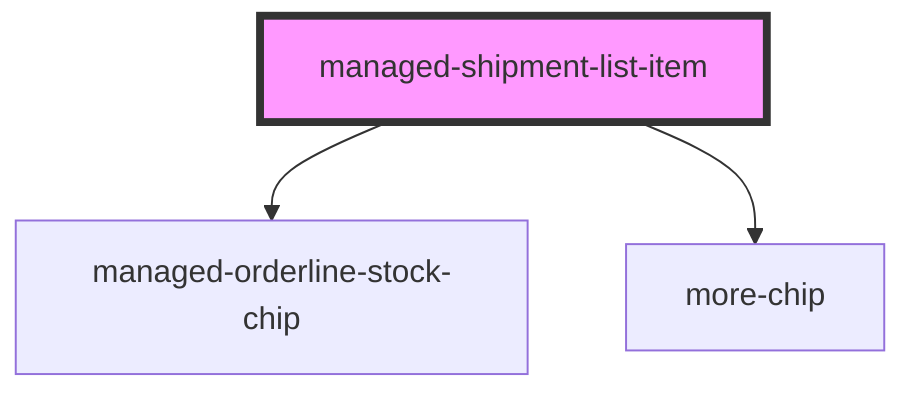

# managed-shipment-list-item

<!-- Auto Generated Below -->

## Properties

| Property            | Attribute             | Description | Type     | Default                |
| ------------------- | --------------------- | ----------- | -------- | ---------------------- |
| `shipmentId`        | `shipment-id`         |             | `string` | `undefined`            |
| `shipmentLineCount` | `shipment-line-count` |             | `number` | `4`                    |
| `type`              | `type`                |             | `string` | `SHIPMENT_TYPE.ISSUED` |

## Events

| Event                | Description                                             | Type               |
| -------------------- | ------------------------------------------------------- | ------------------ |
| `ssapp-navigate-tab` | Through this event navigation requests to tabs are made | `CustomEvent<any>` |
| `ssapp-send-error`   | Through this event errors are passed                    | `CustomEvent<any>` |

## Methods

### `refresh() => Promise<void>`

#### Returns

Type: `Promise<void>`

## Dependencies

### Depends on

- [managed-orderline-stock-chip](../managed-orderline-stock-chip)
- [more-chip](../more-chip)

### Graph

----------------------------------------------

*Built with [StencilJS](https://stenciljs.com/)*
