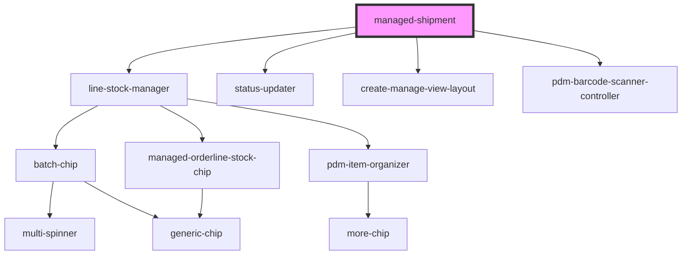

# managed-shipment

<!-- Auto Generated Below -->

## Properties

| Property              | Attribute               | Description | Type     | Default                      |
| --------------------- | ----------------------- | ----------- | -------- | ---------------------------- |
| `availableString`     | `available-string`      |             | `string` | `'Available:'`               |
| `backString`          | `back-string`           |             | `string` | `"Back"`                     |
| `clearString`         | `clear-string`          |             | `string` | `"Clear"`                    |
| `confirmAllString`    | `confirm-all-string`    |             | `string` | `'Confirm All'`              |
| `confirmedString`     | `confirmed-string`      |             | `string` | `'Confirmed:'`               |
| `createString`        | `create-string`         |             | `string` | `"Issue Shipment"`           |
| `fromAtString`        | `from-at-string`        |             | `string` | `'At:'`                      |
| `fromString`          | `from-string`           |             | `string` | `'Shipment from:'`           |
| `identity`            | `identity`              |             | `any`    | `undefined`                  |
| `manageString`        | `manage-title-string`   |             | `string` | `"Manage String"`            |
| `noStockString`       | `no-stock-string`       |             | `string` | `'Empty'`                    |
| `orderIdString`       | `order-id-string`       |             | `string` | `'Order Id:'`                |
| `orderJSON`           | `order-json`            |             | `string` | `undefined`                  |
| `orderMissingString`  | `order-missing-string`  |             | `string` | `'Order Missing'`            |
| `productsCodeString`  | `products-code-string`  |             | `string` | `'Product Code:'`            |
| `productsString`      | `products-string`       |             | `string` | `'Products:'`                |
| `quantityString`      | `quantity-string`       |             | `string` | `'Quantity:'`                |
| `remainingString`     | `remaining-string`      |             | `string` | `'Remaining:'`               |
| `resetAllString`      | `reset-all-string`      |             | `string` | `'Reset All'`                |
| `scanString`          | `scanner-title-string`  |             | `string` | `"Please Scan your Product"` |
| `selectString`        | `select-string`         |             | `string` | `'Please Select an item...'` |
| `shipmentRef`         | `shipment-ref`          |             | `string` | `undefined`                  |
| `shipmentType`        | `shipment-type`         |             | `string` | `SHIPMENT_TYPE.ISSUED`       |
| `statusString`        | `status-string`         |             | `string` | `'Shipment Status:'`         |
| `statuses`            | `statuses`              |             | `any`    | `undefined`                  |
| `stockString`         | `stock-string`          |             | `string` | `'Stock:'`                   |
| `titleString`         | `create-title-string`   |             | `string` | `"Title String"`             |
| `toAtString`          | `to-at-string`          |             | `string` | `'from:'`                    |
| `toPlaceholderString` | `to-placeholder-string` |             | `string` | `'Select a requester...'`    |
| `to_String`           | `to-string`             |             | `string` | `'Shipment to:'`             |
| `unavailableString`   | `unavailable-string`    |             | `string` | `'Unavailable:'`             |

## Events

| Event                 | Description                                             | Type               |
| --------------------- | ------------------------------------------------------- | ------------------ |
| `ssapp-action`        | Through this event action requests are made             | `CustomEvent<any>` |
| `ssapp-back-navigate` | Through this event back navigation requests are made    | `CustomEvent<any>` |
| `ssapp-navigate-tab`  | Through this event navigation requests to tabs are made | `CustomEvent<any>` |
| `ssapp-send-error`    | Through this event errors are passed                    | `CustomEvent<any>` |

## Methods

### `refresh() => Promise<void>`

#### Returns

Type: `Promise<void>`

### `reset() => Promise<void>`

#### Returns

Type: `Promise<void>`

### `updateDirectory() => Promise<void>`

#### Returns

Type: `Promise<void>`

## Dependencies

### Depends on

- [line-stock-manager](../line-stock-manager)
- [status-updater](../status-updater)
- [create-manage-view-layout](../create-manage-view-layout)
- [pdm-barcode-scanner-controller](../pdm-barcode-scanner-controller)

### Graph

----------------------------------------------

*Built with [StencilJS](https://stenciljs.com/)*
