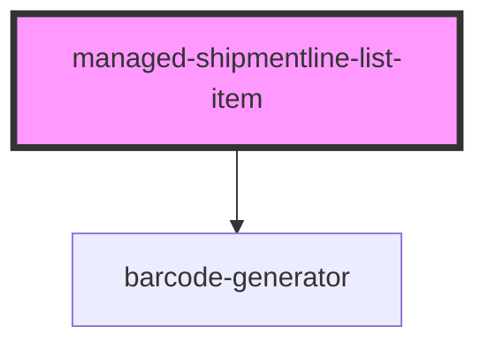

# managed-shipmentline-list-item

<!-- Auto Generated Below -->

## Properties

| Property         | Attribute          | Description | Type     | Default         |
| ---------------- | ------------------ | ----------- | -------- | --------------- |
| `batchLabel`     | `bach-label`       |             | `string` | `"Batch:"`      |
| `createdOnLabel` | `created-on-label` |             | `string` | `"Created on:"` |
| `gtinLabel`      | `gtin-label`       |             | `string` | `"Gtin:"`       |
| `nameLabel`      | `name-label`       |             | `string` | `"Name:"`       |
| `quantityLabel`  | `quantity-label`   |             | `string` | `"Quantity:"`   |
| `requesterLabel` | `requester-label`  |             | `string` | `"Requester:"`  |
| `senderLabel`    | `sender-label`     |             | `string` | `"Sender:"`     |
| `shipmentLine`   | `shipment-line`    |             | `string` | `undefined`     |
| `statusLabel`    | `status-label`     |             | `string` | `"Status:"`     |

## Events

| Event                | Description                                             | Type               |
| -------------------- | ------------------------------------------------------- | ------------------ |
| `ssapp-navigate-tab` | Through this event navigation requests to tabs are made | `CustomEvent<any>` |
| `ssapp-send-error`   | Through this event errors are passed                    | `CustomEvent<any>` |

## Methods

### `refresh() => Promise<void>`

#### Returns

Type: `Promise<void>`

## Dependencies

### Depends on

- [barcode-generator](../barcode-generator)

### Graph

----------------------------------------------

*Built with [StencilJS](https://stenciljs.com/)*
