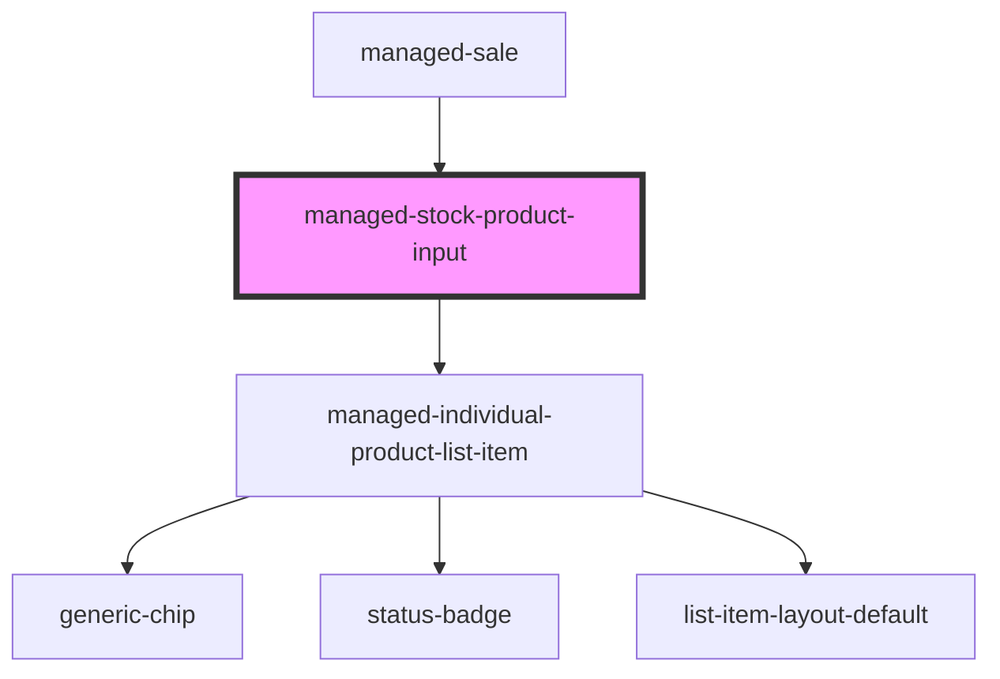

# managed-stock-product-input

<!-- Auto Generated Below -->

## Properties

| Property             | Attribute              | Description | Type                                 | Default           |
| -------------------- | ---------------------- | ----------- | ------------------------------------ | ----------------- |
| `directoryString`    | `directory-string`     |             | `string`                             | `'Directory:'`    |
| `disabled`           | `disabled`             |             | `boolean`                            | `false`           |
| `labelPosition`      | `label-position`       |             | `"fixed" \| "floating" \| "stacked"` | `'floating'`      |
| `lines`              | `lines`                |             | `"full" \| "inset" \| "none"`        | `'inset'`         |
| `name`               | `name`                 |             | `string`                             | `undefined`       |
| `productsCodeString` | `products-code-string` |             | `string`                             | `'Product Code:'` |
| `productsString`     | `products-string`      |             | `string`                             | `'Products:'`     |
| `quantityString`     | `quantity-string`      |             | `string`                             | `'Quantity:'`     |
| `required`           | `required`             |             | `boolean`                            | `false`           |
| `value`              | `value`                |             | `string`                             | `'[]'`            |

## Events

| Event              | Description                          | Type               |
| ------------------ | ------------------------------------ | ------------------ |
| `ssapp-send-error` | Through this event errors are passed | `CustomEvent<any>` |

## Methods

### `updateDirectory(gtin?: string) => Promise<void>`

#### Returns

Type: `Promise<void>`

## Dependencies

### Used by

 - [managed-sale](../managed-sale)

### Depends on

- [managed-individual-product-list-item](../managed-individual-product-list-item)

### Graph

----------------------------------------------

*Built with [StencilJS](https://stenciljs.com/)*
