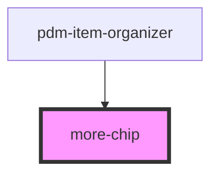

# more-chip

<!-- Auto Generated Below -->

## Properties

| Property   | Attribute           | Description | Type      | Default                 |
| ---------- | ------------------- | ----------- | --------- | ----------------------- |
| `color`    | `color`             |             | `string`  | `'medium'`              |
| `float`    | `float-more-button` |             | `boolean` | `false`                 |
| `iconName` | `icon-name`         |             | `string`  | `"ellipsis-horizontal"` |

## Events

| Event             | Description                                 | Type               |
| ----------------- | ------------------------------------------- | ------------------ |
| `ssapp-show-more` | Through this event the clickEvent is passed | `CustomEvent<any>` |

## Dependencies

### Used by

 - [pdm-item-organizer](../pdm-item-organizer)

### Graph

----------------------------------------------

*Built with [StencilJS](https://stenciljs.com/)*
