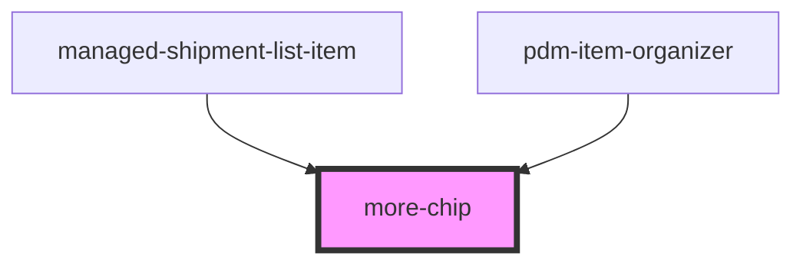

# more-chip

<!-- Auto Generated Below -->

## Properties

| Property   | Attribute   | Description | Type     | Default                 |
| ---------- | ----------- | ----------- | -------- | ----------------------- |
| `color`    | `color`     |             | `string` | `'medium'`              |
| `iconName` | `icon-name` |             | `string` | `"ellipsis-horizontal"` |

## Events

| Event             | Description                                 | Type               |
| ----------------- | ------------------------------------------- | ------------------ |
| `ssapp-show-more` | Through this event the clickEvent is passed | `CustomEvent<any>` |

## Dependencies

### Used by

 - [managed-shipment-list-item](../managed-shipment-list-item)
 - [pdm-item-organizer](../pdm-item-organizer)

### Graph

----------------------------------------------

*Built with [StencilJS](https://stenciljs.com/)*
