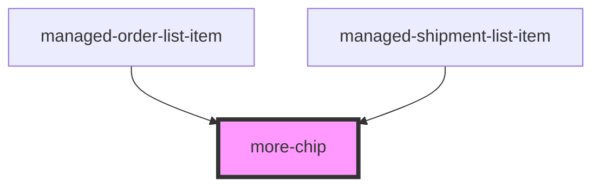

# more-chip

<!-- Auto Generated Below -->

## Properties

| Property   | Attribute   | Description | Type      | Default     |
| ---------- | ----------- | ----------- | --------- | ----------- |
| `color`    | `color`     |             | `string`  | `'primary'` |
| `float`    | `float`     |             | `string`  | `undefined` |
| `iconName` | `icon-name` |             | `string`  | `undefined` |
| `outline`  | `outline`   |             | `boolean` | `true`      |
| `text`     | `text`      |             | `string`  | `undefined` |

## Events

| Event             | Description                          | Type               |
| ----------------- | ------------------------------------ | ------------------ |
| `ssapp-show-more` | Through this event errors are passed | `CustomEvent<any>` |

## Dependencies

### Used by

 - [managed-order-list-item](../managed-order-list-item)
 - [managed-shipment-list-item](../managed-shipment-list-item)

### Graph

----------------------------------------------

*Built with [StencilJS](https://stenciljs.com/)*
