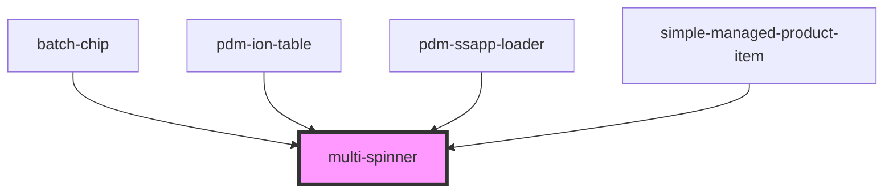

# multi-spinner

<!-- Auto Generated Below -->

## Properties

| Property | Attribute | Description | Type     | Default                    |
| -------- | --------- | ----------- | -------- | -------------------------- |
| `type`   | `type`    |             | `string` | `SUPPORTED_LOADERS.simple` |

## Dependencies

### Used by

 - [batch-chip](../batch-chip)
 - [pdm-ion-table](../pdm-ion-table)
 - [pdm-ssapp-loader](../pdm-ssapp-loader)
 - [simple-managed-product-item](../simple-managed-product-item)

### Graph

----------------------------------------------

*Built with [StencilJS](https://stenciljs.com/)*
