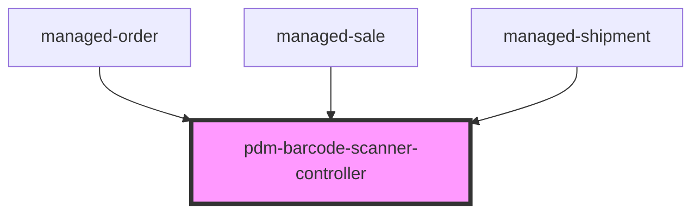

# pdm-barcode-scanner-controller

<!-- Auto Generated Below -->

## Properties

| Property       | Attribute       | Description | Type     | Default            |
| -------------- | --------------- | ----------- | -------- | ------------------ |
| `barcodeTitle` | `barcode-title` |             | `string` | `"Barcode Reader"` |
| `scannerMode`  | `scanner-mode`  |             | `string` | `SCANNER_MODE.WEB` |

## Methods

### `changeCamera() => Promise<void>`

#### Returns

Type: `Promise<void>`

### `dismiss(result?: any) => Promise<void>`

#### Returns

Type: `Promise<void>`

### `holdForScan(callback: any) => Promise<any>`

#### Returns

Type: `Promise<any>`

### `present(props?: any, callback?: any) => Promise<any>`

#### Returns

Type: `Promise<any>`

## Dependencies

### Used by

 - [managed-order](../managed-order)
 - [managed-sale](../managed-sale)
 - [managed-shipment](../managed-shipment)

### Graph

----------------------------------------------

*Built with [StencilJS](https://stenciljs.com/)*
