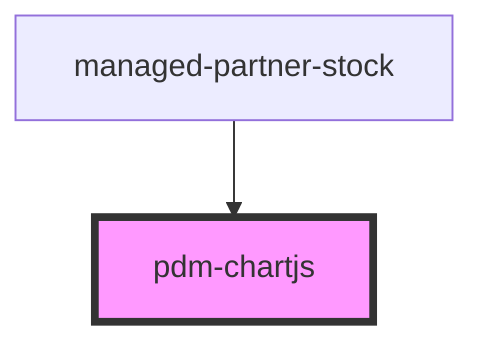

# pdm-chartjs

<!-- Auto Generated Below -->

## Properties

| Property          | Attribute              | Description | Type      | Default       |
| ----------------- | ---------------------- | ----------- | --------- | ------------- |
| `cardSubTitle`    | `card-sub-title`       |             | `string`  | `'sub-title'` |
| `cardTitle`       | `card-title`           |             | `string`  | `'Title'`     |
| `containerId`     | `container-id`         |             | `string`  | `'DTDACXSWQ'` |
| `data`            | `data`                 |             | `string`  | `'[]'`        |
| `options`         | `options`              |             | `string`  | `'{}'`        |
| `showDataTable`   | `show-data-table`      |             | `boolean` | `false`       |
| `tableDataSrc`    | `table-data-source`    |             | `string`  | `'[]'`        |
| `tableDataStruct` | `table-data-structure` |             | `string`  | `'[]'`        |
| `type`            | `type`                 |             | `string`  | `'bar'`       |

## Events

| Event          | Description | Type               |
| -------------- | ----------- | ------------------ |
| `chart-action` |             | `CustomEvent<any>` |

## Dependencies

### Used by

 - [managed-partner-stock](../managed-partner-stock)

### Graph

----------------------------------------------

*Built with [StencilJS](https://stenciljs.com/)*
