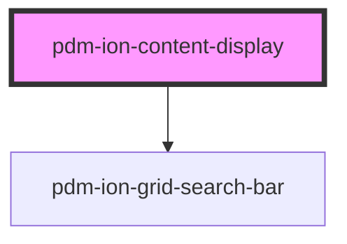

# pdm-ion-table

<!-- Auto Generated Below -->

## Properties

| Property        | Attribute         | Description                     | Type     | Default               |
| --------------- | ----------------- | ------------------------------- | -------- | --------------------- |
| `buttonDataTag` | `button-data-tag` |                                 | `string` | `undefined`           |
| `buttonLabel`   | `button-text`     |                                 | `string` | `undefined`           |
| `contentTitle`  | `content-title`   | Content Header Graphical Params | `string` | `'PDM Ionic Content'` |
| `iconName`      | `icon-name`       |                                 | `string` | `"albums"`            |

## Methods

### `refresh() => Promise<void>`

#### Returns

Type: `Promise<void>`

## Dependencies

### Depends on

- [pdm-ion-grid-search-bar](../pdm-ion-grid-search-bar)

### Graph

----------------------------------------------

*Built with [StencilJS](https://stenciljs.com/)*
