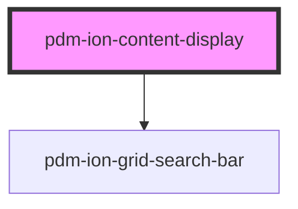

# pdm-ion-table

<!-- Auto Generated Below -->

## Properties

| Property       | Attribute               | Description                         | Type      | Default                    |
| -------------- | ----------------------- | ----------------------------------- | --------- | -------------------------- |
| `canQuery`     | `can-query`             | Shows the search bar or not.        | `boolean` | `true`                     |
| `contentTitle` | `content-title`         | Content Header Graphical Params     | `string`  | `'PDM Ionic Content'`      |
| `hasButton`    | `has-button`            |                                     | `boolean` | `false`                    |
| `iconName`     | `icon-name`             |                                     | `string`  | `"albums"`                 |
| `manager`      | `manager`               | sets the name of the manager to use | `string`  | `undefined`                |
| `placeholder`  | `searchbar-placeholder` |                                     | `string`  | `'enters search terms...'` |

## Events

| Event              | Description                          | Type               |
| ------------------ | ------------------------------------ | ------------------ |
| `ssapp-send-error` | Through this event errors are passed | `CustomEvent<any>` |

## Methods

### `refresh() => Promise<void>`

#### Returns

Type: `Promise<void>`

## Dependencies

### Depends on

- [pdm-ion-grid-search-bar](../pdm-ion-grid-search-bar)

### Graph

----------------------------------------------

*Built with [StencilJS](https://stenciljs.com/)*
