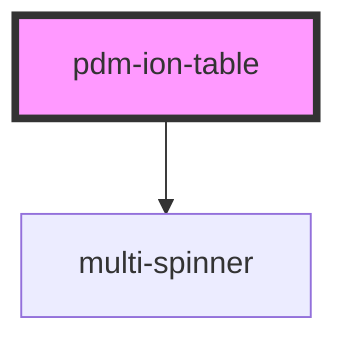

# pdm-ion-table

<!-- Auto Generated Below -->

## Properties

| Property           | Attribute            | Description                                                                                                                    | Type       | Default             |
| ------------------ | -------------------- | ------------------------------------------------------------------------------------------------------------------------------ | ---------- | ------------------- |
| `buttons`          | --                   |                                                                                                                                | `string[]` | `[]`                |
| `canQuery`         | `can-query`          | Shows the search bar or not. (not working)                                                                                     | `boolean`  | `false`             |
| `currentPage`      | `current-page`       |                                                                                                                                | `number`   | `0`                 |
| `iconName`         | `icon-name`          |                                                                                                                                | `string`   | `undefined`         |
| `itemProps`        | `item-props`         | Option props to be passed to child elements in 'key1:attr1;key2:attr2' format                                                  | `string`   | `undefined`         |
| `itemReference`    | `item-reference`     | the querying attribute name so the items can query their own value                                                             | `string`   | `undefined`         |
| `itemType`         | `item-type`          | The tag for the item type that the table should use eg: 'li' would create list items                                           | `string`   | `undefined`         |
| `itemsPerPage`     | `items-per-page`     |                                                                                                                                | `number`   | `10`                |
| `loadingMessage`   | `loading-message`    |                                                                                                                                | `string`   | `"Loading..."`      |
| `manager`          | `manager`            | sets the name of the manager to use Only required if mode if {@link PdmIonTable#mode} is set to {@link ION_TABLE_MODES.BY_REF} | `string`   | `undefined`         |
| `noContentMessage` | `no-content-message` |                                                                                                                                | `string`   | `"No Content"`      |
| `pageCount`        | `page-count`         |                                                                                                                                | `number`   | `0`                 |
| `paginated`        | `paginated`          |                                                                                                                                | `boolean`  | `true`              |
| `query`            | `query`              | Querying/paginating Params - only available when mode is set by ref                                                            | `string`   | `undefined`         |
| `sort`             | `sort`               |                                                                                                                                | `string`   | `undefined`         |
| `title`            | `title`              | Graphical Params                                                                                                               | `string`   | `'PDM Ionic Table'` |

## Events

| Event              | Description                          | Type               |
| ------------------ | ------------------------------------ | ------------------ |
| `ssapp-send-error` | Through this event errors are passed | `CustomEvent<any>` |

## Methods

### `refresh() => Promise<void>`

#### Returns

Type: `Promise<void>`

## Dependencies

### Depends on

- [multi-spinner](../multi-spinner)

### Graph

----------------------------------------------

*Built with [StencilJS](https://stenciljs.com/)*
