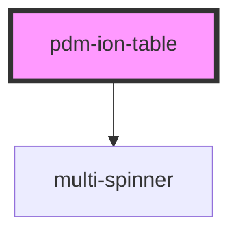

# pdm-ion-table

<!-- Auto Generated Below -->

## Properties

| Property           | Attribute            | Description                                                                                                                                                                                                                            | Type       | Default                  |
| ------------------ | -------------------- | -------------------------------------------------------------------------------------------------------------------------------------------------------------------------------------------------------------------------------------- | ---------- | ------------------------ |
| `buttons`          | --                   |                                                                                                                                                                                                                                        | `string[]` | `[]`                     |
| `canQuery`         | `can-query`          | Shows the search bar or not. (not working)                                                                                                                                                                                             | `boolean`  | `false`                  |
| `currentPage`      | `current-page`       |                                                                                                                                                                                                                                        | `number`   | `0`                      |
| `iconName`         | `icon-name`          |                                                                                                                                                                                                                                        | `string`   | `undefined`              |
| `itemReference`    | `item-reference`     | if the {@link PdmIonTable} is set to mode:  - {@link ION_TABLE_MODES.BY_REF}: must be the querying attribute name so the items can query their own value  - {@link ION_TABLE_MODES.BY_MODEL}: must be the model chain for content list | `string`   | `undefined`              |
| `itemType`         | `item-type`          | The tag for the item type that the table should use eg: 'li' would create list items                                                                                                                                                   | `string`   | `undefined`              |
| `itemsPerPage`     | `items-per-page`     |                                                                                                                                                                                                                                        | `number`   | `10`                     |
| `loadingMessage`   | `loading-message`    |                                                                                                                                                                                                                                        | `string`   | `"Loading..."`           |
| `manager`          | `manager`            | sets the name of the manager to use Only required if mode if {@link PdmIonTable#mode} is set to {@link ION_TABLE_MODES.BY_REF}                                                                                                         | `string`   | `undefined`              |
| `mode`             | `mode`               | can be any of {@link ION_TABLE_MODES} Decides if the tables works by:  - {@link ION_TABLE_MODES.BY_MODEL}: uses the WebCardinal model api                                                                                              | `string`   | `ION_TABLE_MODES.BY_REF` |
| `noContentMessage` | `no-content-message` |                                                                                                                                                                                                                                        | `string`   | `"No Content"`           |
| `pageCount`        | `page-count`         |                                                                                                                                                                                                                                        | `number`   | `0`                      |
| `paginated`        | `paginated`          |                                                                                                                                                                                                                                        | `boolean`  | `true`                   |
| `query`            | `query`              | Querying/paginating Params - only available when mode is set by ref                                                                                                                                                                    | `string`   | `undefined`              |
| `sort`             | `sort`               |                                                                                                                                                                                                                                        | `string`   | `undefined`              |
| `title`            | `title`              | Graphical Params                                                                                                                                                                                                                       | `string`   | `'PDM Ionic Table'`      |

## Events

| Event            | Description                                                                                                                | Type               |
| ---------------- | -------------------------------------------------------------------------------------------------------------------------- | ------------------ |
| `getModelEvent`  | Through this event model is received (from webc-container, webc-for, webc-if or any component that supports a controller). | `CustomEvent<any>` |
| `sendErrorEvent` | Through this event errors are passed                                                                                       | `CustomEvent<any>` |

## Methods

### `refresh() => Promise<void>`

#### Returns

Type: `Promise<void>`

## Dependencies

### Depends on

- [multi-spinner](../multi-spinner)

### Graph

----------------------------------------------

*Built with [StencilJS](https://stenciljs.com/)*
