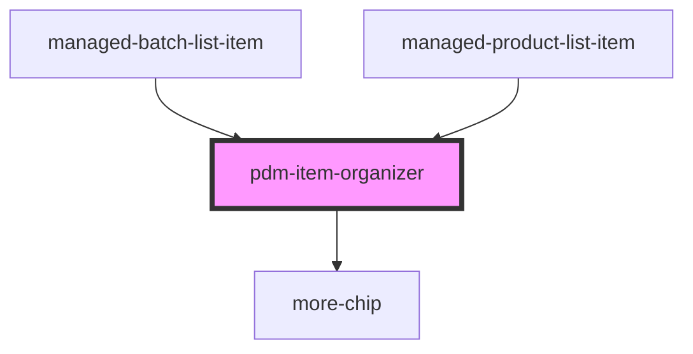

# pdm-item-organizer

<!-- Auto Generated Below -->

## Properties

| Property         | Attribute         | Description                                                                                                    | Type                 | Default     |
| ---------------- | ----------------- | -------------------------------------------------------------------------------------------------------------- | -------------------- | ----------- |
| `clickHandler`   | --                | The Handler on the click in each item when expanded                                                            | `(any: any) => void` | `undefined` |
| `componentName`  | `component-name`  | the Tag for the component to be rendered                                                                       | `string`             | `undefined` |
| `componentProps` | `component-props` | the list of props that will be passed to the HTML Element {@link componentName}                                | `string`             | `undefined` |
| `displayCount`   | `display-count`   | The number of items to display (minimum is 1), defaults to 3                                                   | `number`             | `3`         |
| `idProp`         | `id-prop`         | The identifying prop to be return upon click (must exist in the supplied {@link componentProps}                | `string`             | `undefined` |
| `isItem`         | `is-ion-item`     | If the component does not generate an ion-item (so it can be handled by an ion-list) this must be set to false | `boolean`            | `true`      |

## Dependencies

### Used by

 - [managed-batch-list-item](../managed-batch-list-item)
 - [managed-product-list-item](../managed-product-list-item)

### Depends on

- [more-chip](../more-chip)

### Graph

----------------------------------------------

*Built with [StencilJS](https://stenciljs.com/)*
