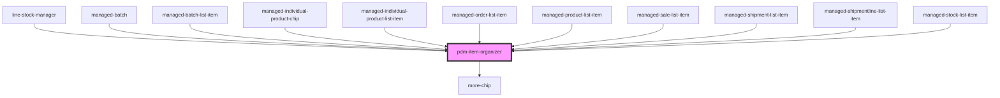

# pdm-item-organizer

<!-- Auto Generated Below -->

## Properties

| Property              | Attribute               | Description                                                                                                                                         | Type                                                                | Default                                                             |
| --------------------- | ----------------------- | --------------------------------------------------------------------------------------------------------------------------------------------------- | ------------------------------------------------------------------- | ------------------------------------------------------------------- |
| `componentName`       | `component-name`        | the Tag for the component to be rendered                                                                                                            | `string`                                                            | `undefined`                                                         |
| `componentProps`      | `component-props`       | the list of props that will be passed to the HTML Element {@link componentName}                                                                     | `string`                                                            | `undefined`                                                         |
| `displayCount`        | `display-count`         | display-count": The number of items to display (minimum is 0), defaults to 3 display-count-divider: separate/break content into corresponding value | `number`                                                            | `3`                                                                 |
| `displayCountDivider` | `display-count-divider` |                                                                                                                                                     | `number`                                                            | `170`                                                               |
| `idProp`              | `id-prop`               | The identifying prop to be return upon click (must exist in the supplied {@link componentProps}                                                     | `string`                                                            | `undefined`                                                         |
| `isItem`              | `is-ion-item`           | If the component does not generate an ion-item (so it can be handled by an ion-list) this must be set to false                                      | `boolean`                                                           | `true`                                                              |
| `moreChipsPosition`   | `more-chips-position`   |                                                                                                                                                     | `"end" \| "start"`                                                  | `this.orientation === "end" \|\| this.singleLine ? "start" : "end"` |
| `moreIcon`            | `more-icon`             |                                                                                                                                                     | `string`                                                            | `"ellipsis-horizontal"`                                             |
| `moreLabel`           | `more-label`            |                                                                                                                                                     | `string`                                                            | `undefined`                                                         |
| `orientation`         | `orientation`           |                                                                                                                                                     | `"around" \| "between" \| "center" \| "end" \| "evenly" \| "start"` | `"end"`                                                             |
| `singleLine`          | `single-line`           |                                                                                                                                                     | `boolean`                                                           | `true`                                                              |

## Events

| Event         | Description | Type                  |
| ------------- | ----------- | --------------------- |
| `selectEvent` |             | `CustomEvent<string>` |

## Dependencies

### Used by

 - [line-stock-manager](../line-stock-manager)
 - [managed-batch](../managed-batch)
 - [managed-batch-list-item](../managed-batch-list-item)
 - [managed-individual-product-chip](../managed-individual-product-chip)
 - [managed-individual-product-list-item](../managed-individual-product-list-item)
 - [managed-order-list-item](../managed-order-list-item)
 - [managed-product-list-item](../managed-product-list-item)
 - [managed-sale-list-item](../managed-sale-list-item)
 - [managed-shipment-list-item](../managed-shipment-list-item)
 - [managed-shipmentline-list-item](../managed-shipmentline-list-item)
 - [managed-stock-list-item](../managed-stock-list-item)

### Depends on

- [more-chip](../more-chip)

### Graph

----------------------------------------------

*Built with [StencilJS](https://stenciljs.com/)*
