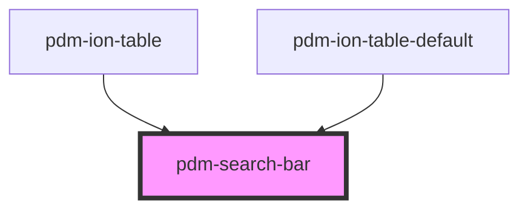

# pdm-search-bar

<!-- Auto Generated Below -->

## Properties

| Property      | Attribute      | Description | Type                 | Default                   |
| ------------- | -------------- | ----------- | -------------------- | ------------------------- |
| `btnLabel`    | `btn-label`    |             | `string`             | `'Search'`                |
| `displayType` | `display-type` |             | `"full" \| "normal"` | `"normal"`                |
| `placeholder` | `placeholder`  |             | `string`             | `'enter search terms...'` |

## Events

| Event    | Description | Type               |
| -------- | ----------- | ------------------ |
| `search` |             | `CustomEvent<any>` |

## Dependencies

### Used by

 - [pdm-ion-table](../pdm-ion-table)
 - [pdm-ion-table-default](../pdm-ion-table-default)

### Graph

----------------------------------------------

*Built with [StencilJS](https://stenciljs.com/)*
