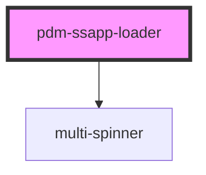

# pdm-ssapp-loader

<!-- Auto Generated Below -->

## Properties

| Property  | Attribute | Description | Type     | Default                    |
| --------- | --------- | ----------- | -------- | -------------------------- |
| `loader`  | `loader`  |             | `string` | `SUPPORTED_LOADERS.simple` |
| `timeout` | `timeout` |             | `number` | `1000`                     |

## Methods

### `markAsLoaded(evt: any) => Promise<void>`

#### Returns

Type: `Promise<void>`

### `updateStatus(evt: any) => Promise<void>`

#### Returns

Type: `Promise<void>`

## Dependencies

### Depends on

- [multi-spinner](../multi-spinner)

### Graph

----------------------------------------------

*Built with [StencilJS](https://stenciljs.com/)*
