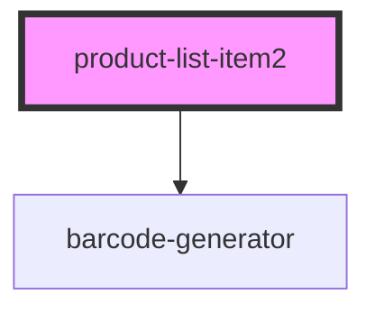

# product-list-item2

<!-- Auto Generated Below -->

## Properties

| Property  | Attribute | Description | Type     | Default            |
| --------- | --------- | ----------- | -------- | ------------------ |
| `gtin`    | `gtin`    |             | `string` | `undefined`        |
| `manager` | `manager` |             | `string` | `"ProductManager"` |

## Methods

### `refresh() => Promise<void>`

#### Returns

Type: `Promise<void>`

## Dependencies

### Depends on

- [barcode-generator](../barcode-generator)

### Graph

----------------------------------------------

*Built with [StencilJS](https://stenciljs.com/)*
