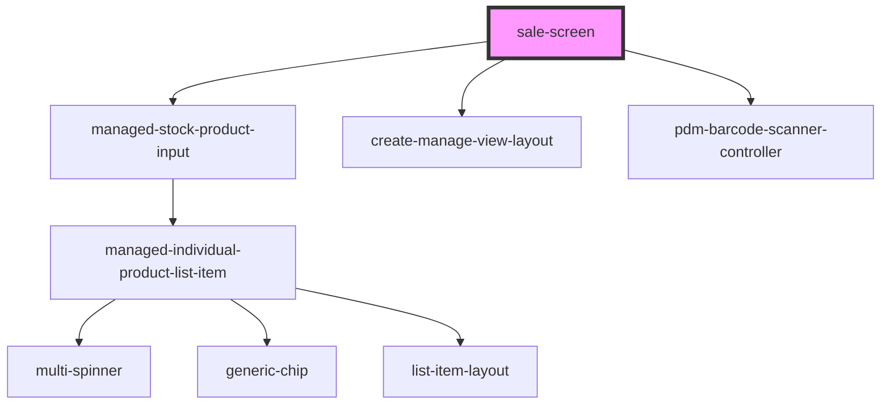

# sale-screen

<!-- Auto Generated Below -->

## Properties

| Property                | Attribute                 | Description | Type     | Default                                 |
| ----------------------- | ------------------------- | ----------- | -------- | --------------------------------------- |
| `backString`            | `back-string`             |             | `string` | `"Back to Products"`                    |
| `clearString`           | `clear-string`            |             | `string` | `"Clear"`                               |
| `createString`          | `create-string`           |             | `string` | `"Issue Sale"`                          |
| `directoryString`       | `directory-string`        |             | `string` | `'Directory:'`                          |
| `manageString`          | `manage-title-string`     |             | `string` | `"Manage String"`                       |
| `productString`         | `product-string`          |             | `string` | `"Please select or scan the products:"` |
| `quantityString`        | `quantity-string`         |             | `string` | `"Please select a quantity:"`           |
| `saleRef`               | `sale-ref`                |             | `string` | `undefined`                             |
| `scanString`            | `scanner-title-string`    |             | `string` | `"Please Scan your Product"`            |
| `selectedProductString` | `selected-product-string` |             | `string` | `"Selected products:"`                  |
| `titleString`           | `create-title-string`     |             | `string` | `"Title String"`                        |

## Events

| Event                | Description                                             | Type               |
| -------------------- | ------------------------------------------------------- | ------------------ |
| `ssapp-action`       | Through this event action requests are made             | `CustomEvent<any>` |
| `ssapp-navigate-tab` | Through this event navigation requests to tabs are made | `CustomEvent<any>` |
| `ssapp-send-error`   |                                                         | `CustomEvent<any>` |

## Methods

### `refresh() => Promise<void>`

#### Returns

Type: `Promise<void>`

### `updateDirectory() => Promise<void>`

#### Returns

Type: `Promise<void>`

## Dependencies

### Depends on

- [managed-stock-product-input](../managed-stock-product-input)
- [create-manage-view-layout](../create-manage-view-layout)
- [pdm-barcode-scanner-controller](../pdm-barcode-scanner-controller)

### Graph

----------------------------------------------

*Built with [StencilJS](https://stenciljs.com/)*
