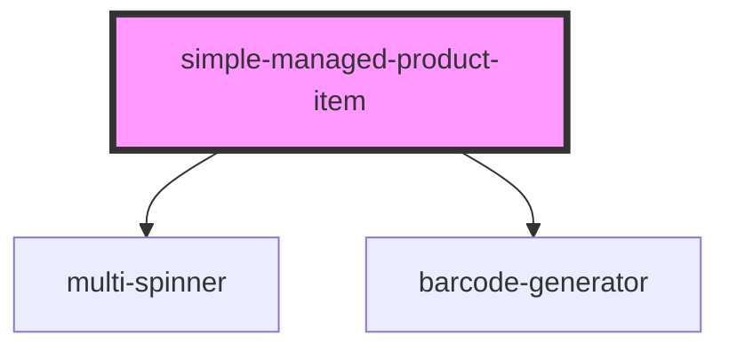

# simple-managed-product-item

<!-- Auto Generated Below -->

## Properties

| Property | Attribute | Description | Type     | Default     |
| -------- | --------- | ----------- | -------- | ----------- |
| `gtin`   | `gtin`    |             | `string` | `undefined` |

## Events

| Event              | Description                                             | Type               |
| ------------------ | ------------------------------------------------------- | ------------------ |
| `ssapp-action`     | Through this event navigation requests to tabs are made | `CustomEvent<any>` |
| `ssapp-send-error` | Through this event errors are passed                    | `CustomEvent<any>` |

## Methods

### `refresh() => Promise<void>`

#### Returns

Type: `Promise<void>`

## Dependencies

### Depends on

- [multi-spinner](../multi-spinner)
- [barcode-generator](../barcode-generator)

### Graph

----------------------------------------------

*Built with [StencilJS](https://stenciljs.com/)*
