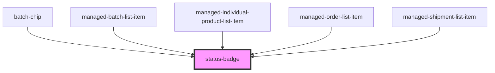

# status-badge

<!-- Auto Generated Below -->

## Properties

| Property | Attribute | Description | Type     | Default     |
| -------- | --------- | ----------- | -------- | ----------- |
| `status` | `status`  |             | `string` | `undefined` |

## Dependencies

### Used by

 - [batch-chip](../batch-chip)
 - [managed-batch-list-item](../managed-batch-list-item)
 - [managed-individual-product-list-item](../managed-individual-product-list-item)
 - [managed-order-list-item](../managed-order-list-item)
 - [managed-shipment-list-item](../managed-shipment-list-item)

### Graph

----------------------------------------------

*Built with [StencilJS](https://stenciljs.com/)*
